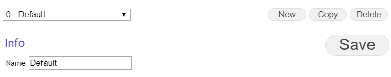
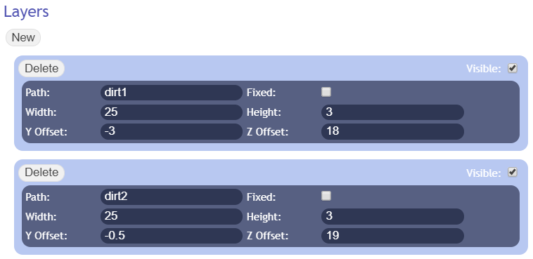

# Battle Environment Editor
To access the Battle Environment Editor hit F11 on the main title screen and select "Battle Environment Editor" from the top right drop down menu.

## Battle Environments

A battle environment defines the look of the battle scene. A battle environment is constructed with multiple layers that scroll at a fixed speed. The layers can be given depth to create a scrolling parallax effect. Each environment can have one fixed background which always appears the same regardless of camera position.

When constructing a battle environment it is important to keep in mind that unit sprites are at a z offset/depth of 0 by default and the camera is pulled back to a depth of -6.5 units.

In regular use the battle environment is assigned using the setDefaultBattleEnv plugin command in the BattleStart script of a stage. A separate environment can be assigned for flying units using the setSkyBattleEnv command. Separate environments can be assigned to specific regions on the map using the setRegionBattleEnv and setRegionSkyBattleEnv commands. Region specific environments will take priority.

## Editor

### Usage

Existing environments can be selected from the main drop down. The drop down lists the id and the name of the environment. After selection the environment will be shown in the preview window. Environments can be copied or deleted and new environments can be created. The name of the environment can be set, this name is purely for ease of organization, when referring to environments using Plugin Commands the id is used instead.

A Battle Environment consists of multiple layers. New layers can be added by clicking the "New" button and existing layers can be removed using their "Delete" button. A layer can be hidden by unchecking the "Visible" checkbox.

Layers have the following attributes:

* Path: The name of the image file that will be used for this layer. These images file must .png files and should be present in the img/SRWBattleBacks folder of your project. It is possible to use subfolder for these images, if so simply give the proper path, ex.: environment1/dirt1 if you store the images in the "environment1" folder inside of the img/SRWBattleBacks folder.
* Fixed: If set this layer will be set as a fixed background rather than as a scrolling background. Note that an environment can only have one fixed background at a time.
* Width: The width of one loop of the layer in the scene, expressed in scene units. Note that using a very short loop can cause performance issues so this should be avoided.
* Height: The height of one loop of the layer in the scene, expressed in scene units.
* Y Offset: The vertical(height) offset of the layer, expressed in scene units.
* Z Offset: The depth offset of the layer, expressed in scene units.
