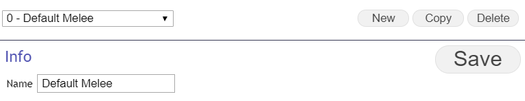
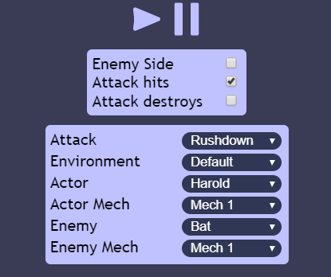
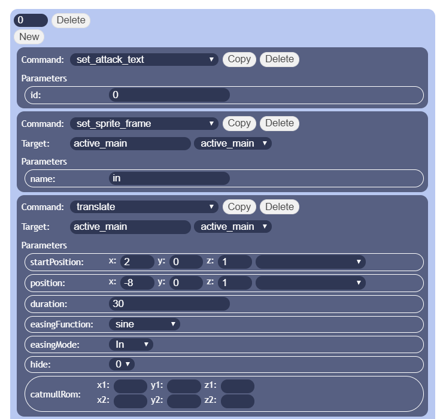

# Attack Editor
To access the Battle Environment Editor hit F11 on the main title screen and select "Attack Editor" from the top right drop down menu.

## Attack Animations

An Attack Animation defines the graphical effects that will be shown in the Main Battle Scene when an attack is used. The main tasks of an Attack Animation are to spawn in assets and to manipulate them(move them around, rotate them, scale them, etc.) to create the desired graphical representation of an attack. 

Attack Animations are defined as a list of Animation Commands that manipulate elements of the Battle Scene.

Attack animations are assigned to weapons using the weaponAnimId tag. If no animation is assigned to an attack the animation with id 0 will play be default.

### Timing

To time the Animation Commands in an Attack Animation each command is assigned to a certain animation Tick. Each animation Tick is 1/60th of a second.

### Basic scene layout

It is important to keep in mind the default positions of key objects in the scene when making an Attack Animation.
Position are shown as (x, y, z).

Main Sprites(Actor, Enemy) are at height 0 and depth 0 with an x offset of 2 from the center.
* actor: (2,0,0)
* enemy: (-2,0,0)

The default position of the Camera is pulled back to -6.5 on the z axis and is elevated by 1.15 on the y axis (0,1.15,-6.5).

These default positions are available from a drop down list when working with position parameters.

### Assets

Assets for Attack Animations live in the following places depending on their type.

Graphics

* img/SRWBattleBacks: Contains image files for Battle Environment layers
* img/SRWBattleScene: Contains sub-folders containing assets for specific units. The folder for a unit should contain the default sprite information for that unit(more details in the section on unit sprites). An attack can use assets from any of the folders, but keeping assets specific to a unit in the matching folder is recommended for keeping things organized.
* img/skyboxes: Contains image files for skyboxes. For more information on how the skyboxes work check this link: doc.babylonjs.com/divingDeeper/environment/skybox
* effekseer: Effekseer export files should be put in this folder and any needed textures should be in the Texture sub-folder. Alternatively you can create a sub-folder and put the Effekseer definition in there, but the sub-folder will need its own Texture folder.

Sound

Sound effect files live in the default RPG Maker folders: audio/se.

### Unit Sprites

There are 6 special sprites that are always available for use in the Battle Scene:

* actor
* actor twin
* actor supporter
* enemy
* enemy twin
* enemy supporter

These sprites are linked to the real mech/class taking part in the Battle Scene and use the mechBattleSceneSprite metadata tag to determine which folder in img/SRWBattleScene belongs to the sprite. The Battle Scene will automatically pull default sprites poses from the matching folder for certain actions. The required default poses are:

* main: Idle pose
* in: Leaning in while moving
* out: Leaning back while moving
* hurt
* dodge

For units that use regular sprites each of these default poses should have a matching .png file in the correct character folder(main.png, hurt.png, etc.)

#### Spriter Sprites

The battle scene supports the use of animated characters created using Spriter(brashmonkey.com/spriter-pro/) and TexturePacker(www.codeandweb.com/texturepacker). A Unit Sprite can be configured to use such a Spriter character. The mechBattleSceneUseSpriter tag of the mech/class metadata must be set to 1 to enable Spriter mode. If Spriter mode is enabled for a mech/class the matching folder in img/SRWBattleScene must contain a sub-folder called "spriter".
This folder should contain the following:

* entity.scon: The exported Spriter character in JSON format. (XML not supported)
* entity.json: The texture atlas metadata generated by TexturePacker.
* entity.png: The Texture atlas generated by TexturePacker.

The Spriter Character must have animations defined with names that match the default poses(main, hurt, dodge, in, out).  
Usage of animation commands is the same between regular and Spriter sprites.

### Dragonbones Sprites

The battle scene supports the use of animated characters created using dragonbones(http://dragonbones.com/en/index.html). The following info needs to be set in the class definition to make a class use a dragonbones sprite:

* \<mechBattleSceneUseDragonBones:1\>: Indicate the class uses a dragonbones sprite
* \<mechBattleSceneCanvasWidth: 1200\>: The width of the resolution at which the sprite will be rendered.
* \<mechBattleSceneCanvasHeight: 1200\>: The height of the resolution at which the sprite will be rendered.
* \<mechBattleSceneDragonBonesSize:5\>: The size to which the full sprite will be scaled when displayed in the battle scene in world units.
* \<mechBattleYOffset: 0\>: A height offset for the sprite when displayed in the battle scene in world units.
* \<mechBattleSceneArmatureName: Dragon\>: The name of the armature in the exported Dragonbones character that should be used.

The dragonbones character must be set up with the matching Armature name defined in the class and it should at least have the following animations defined:

* main: The idle pose for the character
* in: The moving forward pose for the character
* out: The moving backwards pose for the character
* hurt: The taking damage pose for the character
* hurt_end: The animation used to return the character from the damaged pose to the idle pose

It can have any number of additional animations that can be called with the set\_sprite\_frame animation command by name.

The assets for the dragonbones character should be stored in a folder called dragonbones in the SRWBattleScene folder for the class(Ex: img/SRWBattleScene/harold/dragonbones). The assets are the files obtained from exporting the dragonbones project and should have the following names:

* ske.json
* tex.json
* tex.png

### Effekseer Support

The Battle Scene supports displaying particle systems created using the freely available Effekseer(effekseer.github.io/en/) program, though with an important limitation: For technical reasons Effekseer particles systems can only be rendered on top of the rest of the Battle Scene. This means it is impossible to have an effekseer particle system behind any other element of the Battle Scene.

To use an Effekseer particle system simply export the particle system to the .efk format and put it in the effekseer folder of the project and put the required textures in the effekseer/Texture folder. Note that you will need to ensure that the Effekseer project refers to the texture with the correct path, so while making the particle system keep the textures you use in a Texture folder in the same folder as the project file!

Once the files are in the right place the particle system can be displayed in the Battle Scene with the play_effekseer Animation Command.

### Sequences

An Attack Animation can be different depending on the game state. Whether an attack hits, misses or destroys its target will affect how the attack animation plays out. To account for this an attack animation is split into different sequences:

* Main: This sequence will always play and should have the animation commands for the start of the animation.
* Hit: This sequence only plays when the attack hits.
* Hit Twin: This sequence only plays when the attack hits the sub twin.
* Hit Overwrite: This sequence only plays when the attack hits. If any of the animation Ticks of this sequence match a Tick from the Main sequence the Animation Commands from the Main Sequence for that Tick will not be executed.
* Miss: This sequence only plays when the attack misses.
* Miss Twin: This sequence only plays when the attack misses the sub twin.
* Miss Overwrite: This sequence only plays when the attack misses. If any of the animation Ticks of this sequence match a Tick from the Main sequence the Animation Commands from the Main Sequence for that Tick will not be executed.
* Destroy: This sequence only plays when the attack destroys its target.
* Destroy Twin: This sequence only plays when the attack destroys the sub twin.
* Destroy Overwrite: This sequence only plays when the attack destroys its target. If any of the animation Ticks of this sequence match a Tick from the Main/Hit sequence the Animation Commands from the Main/Hit Sequence for that Tick will not be executed.

Ticks for each Sequence start from 0, so if you define a command for the same Tick in the Main and Hit Sequence for example, those commands will be executed at the same time for normal Sequences. For Overwrite sequences the commands of the Overwrite sequence will be the only ones that are executed for the matching Ticks.

Depending on the game state the Battle Scene will combine the necessary sequences to create the final animation:

* The attack misses: Main + Miss + Miss Overwrite
* The attack hits: Main + Hit + Hit Overwrite
* The attack destroys: Main + Hit + Hit Overwrite + Destroy + Destroy Overwrite

The Twin sequences will only be executed when an ALL attack is used an a sub twin target is available.

#### ALL Attacks

ALL attacks are attacks that hit both units in a target twin. They are special in terms of animation as the animation will show one animation for the attack hitting both targets.

To make this possible the target twin unit will be made available for ALL attack animations through the active\_target\_twin command target. active\_target\_twin can be used to animate the target sub twin in the same way any normal sprite is animated. 
Additionally the sub twins animations must go in the Hit Twin, Miss Twin and Destroy Twin sequences. These sequences will only be executed when an ALL attack is used and a target sub twin is available.

### Flow control commands

There a couple of special Animation Commands that help to manage the flow of an Attack Animation:

* next\_phase: this commands is intended for transitioning between the initial part of the Attack Animation, where the attacker gets things started by firing a projectile for example and the second part of the Animation where the target is hit. This command first swipes the screen to black and in this time some additional commands can be executed to set the scene for the second part of the animation(more details on that in the command list). Then if the target has a support defender this command will automatically show an animation where the target and support defender switch places. In this case the command will also delay the rest of the animation so that the designer doesn't need to worry about the time the defender switching takes up. Finally the command swipes the screen back from black and the animation can resume. This command should always be used at the end of the Main Animation sequence!

* reset_position: this command is used to reset the target of the attack animation back to its starting position relative to the current camera position. It will automatically set the target back to its idle stance and display the damage the target has taken. Importantly it will relocate the camera and the target back to the origin of the scene so that the target can start its counterattack without issues. During this transition the background positions are updated so that the transition is not visible to the player. This command should always be used at the end of the Hit sequence to ensure any counterattacks can happen seamlessly! 

### Targets

Many animation commands will have a target. As a rule of thumb commands that create elements will use the target to set the id of the created element and commands that manipulate elements will use the target as the id of the element that will be manipulated.

There a couple of special ids that refer to fixed elements of the scene:

* active\_main: The Sprite of the unit performing the current attack.
* active\_target: The Sprite of the target of the current attack. This reference will refer to the support defender when the support defender is active.
* Camera: The Camera of the Battle Scene.

## Commands

An Attack Animation is constructed as a list of Animation Commands divided into sequences(see above).

[A full reference list for commands is available here.](battle_animation_commands.md)

## Editor

### Usage

#### General Controls

Existing Attack Animations can be selected from the main drop down. The selected Attack Animation can be previewed in the Preview Pane by clicking the Play button. Animations can be copied or deleted and new Animations can be created. Each Animation can be given a name, though this is mostly for organization purposes, when referring to Attack Animations in the engine the id of the Animation will be used.

#### Preview controls

* Play Button
* Stop Button
* Enemy Side: If set the attack will play from the enemy side. Note that the Actor and Enemy settings are not flipped
* Attack Hit: If enabled the Hit Sequence can be tested, if disabled the Miss Sequence can be tested
* Attack Destroys: Of enabled the Destroy sequence can be tested
* Attack: The attack for which the animation should play, this setting is here to enable the correct battle dialogue to play during the preview
* Environment: The Battle Environment in which the preview will take place. Note that the environment will not change for flying participants during the preview.
* Actor: The Pilot on the Actor side
* Actor Mech: The mech on the Actor side
* Enemy: The Pilot on the enemy side
* Enemy mech: The mech on the Enemy side

#### Sequence

The Sequence Drop Down lets you pick which Sequence to edit(see above for more information on Sequences).
The New Tick button prompts for a new Tick to be entered when clicked and will create the New Tick in the current Sequence. 
#### Tick Commands

Each Tick has its own entry. Tick Entries can contain multiple Animation Commands, these Animation commands will start on the same Tick. Tick entries are sorted by their Animation Tick in ascending order. The Tick value can be edited at top left input of the Tick Entry. Keep in mind that if the Tick for a Tick Entry is edited to be later than an other existing Tick their positions will change. If a Tick is edited to the same value as an already existing tick a you will be prompted to either discard the already existing Tick or to combine both Tick Entries.

The Delete button allows removing an entire tick and all its Animation Commands. The New button adds one new Animation Command to the Tick Entry. 

Each Animation Command can have the following attributes:  

* Command: The id of the Animation Command
* Target: The target for the command(optional)
* Parameters: Configuration for the command, the number of parameters depends on the command.

**You can hover over the "Command" text or the name of a Parameter to see a tooltip with more information.** 
For more information on the Animation Commands and their parameters please refer to the [Animation Command list.](battle_animation_commands.md)

