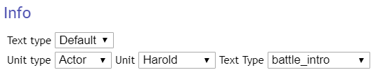
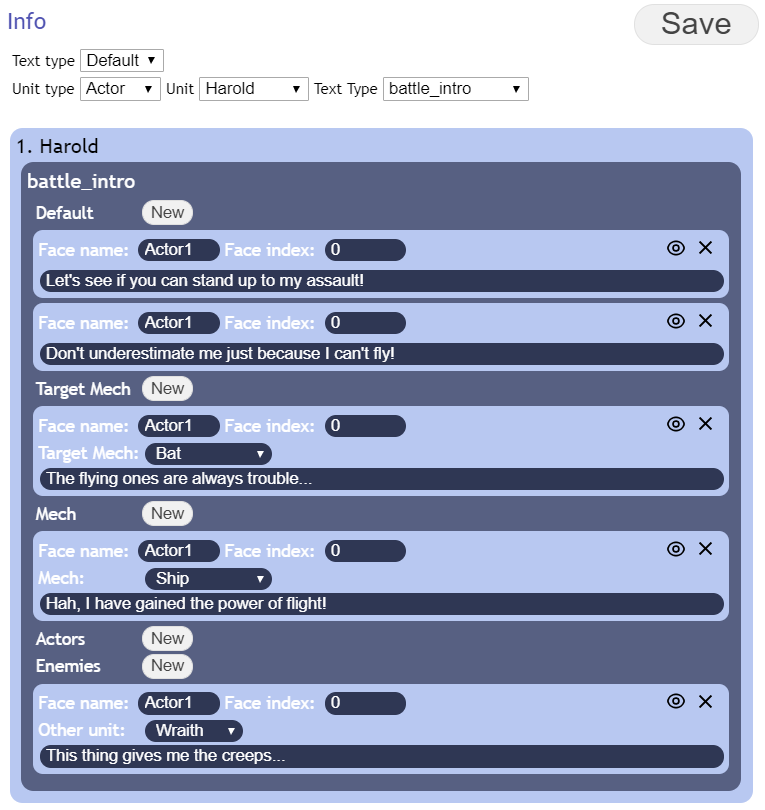

# Battle Text Editor
To access the battle text Editor hit F11 on the main title screen and select "Battle Text Editor" from the top right drop down menu.

## Battle Text
Battle text refers to all text spoken by characters during the battle scene. A Quote refers to one text box which has a FaceName, FaceIndex and text attached to it.

Battle text is separated into Default Battle Text, which can be applied in any battle scene in the game and Special Battle Text which is only applied under specific circumstances. Special Battle Text can be set for a stage by using the setStageTextId plugin command. It can also be set for a scripted battle scene. When Special Battle Text is enabled any quote from the Special Battle Text will be used where applicable. If the Special Battle Text does not specify a quote for a specific scenario, Default Battle Text will be used instead.

To allow characters to respond to a large number of situations, Battle Text can be defined for the following circumstances:

Quote Types:

* battle_intro: Quotes used at the start of battle, before any attack starts.
* retaliate: Quotes used when countering an enemy attack.
* attacks: Quotes used when performing specific attacks. This type is unique in that it also factors in the attack currently being used.
* evade: Quotes used when evading an attack.
* damage: Quotes used after taking damage.
* damage_critical: Quote after taking damage, while HP is low.
* destroyed: Quotes used when destroyed.
* support_defend: Quotes used when providing a support defend.
* support_attack: Quotes used when providing a support attack.

For each of these circumstances quotes are further divided into additional categories. This list is in ascending order or priority.

Quote Sub Types:

* Default: Quotes used if no more specific Quotes are available for the current scenario.
* Target Mech: Quotes used if the pilot is facing a specific Mech.
* Mech: Quotes used if the pilot is in a specific Mech.
* Actors: Quotes used when interacting with specific Actor units. 
* Enemies: Quotes used when interacting with specific Enemy units.

When assigning Quotes the type of the Quote and whether it is an Enemy or Actor quote has to be taken into consideration. For example: When defining support defend Quotes for an Actor, if you want to have a specific quote when defending a specific other Actor, you must use the Actors Sub Type to defined the Quote. On the other hand if you want an Enemy to have a specific quote when battling a specific Actor you also need to use the Actor Sub Type for the Quote.

	
Finally each Sub Type entry can have multiple quotes assigned to them, the game will randomly pick one of the available quotes for the current scenario.

## Editor

### Usage

#### Default Quotes

The Battle Text Editor allows selecting and editing a set of Quotes.

To use the editor first make a selection:

* Text Type: Default or Special
* Unit Type: Actor or Enemy
* Unit: The specific pilot to define text for. A pilot must have a name assigned to them before they show up in this list.
* Text Type: The Type of Quote to edit

After making a selection the currently defined quotes will be displayed: 

For each Sub Type a new quote can be added by clicking the "New" button. A Quote can be deleted by clicking the matching Cross Icon. A Quote can be previewed in the preview window by clicking the Eye Icon.

A Quote always has the following attributes:

* Face name: The name of the Face Picture to be used for the quote.
* Face index: The index of the Face Picture to be used for the quote.
* Text: The displayed text for the Quote.

Additionally the Target Mech and Mech Sub Types offer a select for choosing the Mech to which the quote will apply and the Actors and Enemies Sub Types offer a select for choosing the Pilot to which the quote will apply.

Save you changes by clicking the Save button.

#### Special Quotes

When selecting the Special Text Type additional controls become available: 

The Event select is added which allows selection of previously defined Special Quote sets. The reference id is the id by which the  set of Quotes will be referred to by other parts of the game. When using the setStageTextId plugin command this is the id that should be used in the command. Existing Special Quote sets can be copied and deleted, and new Special Quote Sets can be created.

Editing the Quotes themselves works the same as for Default Quotes. 