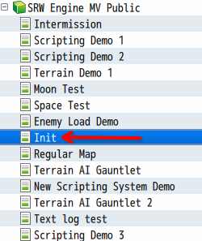
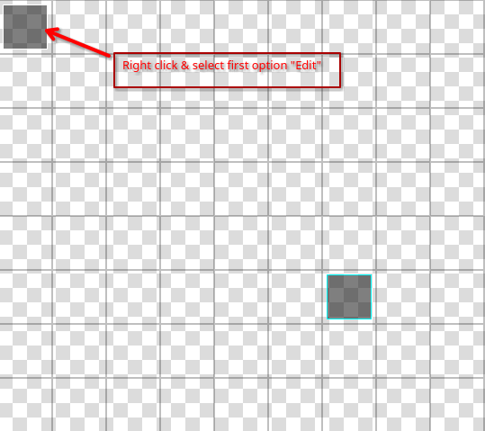
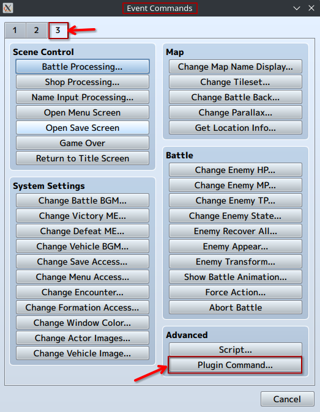

# SRW Engine MV How To v1.0

## Creating a project

### First time set-up

Take the latest version from the #latest-version channel on the discord server. https://discord.gg/hY9rDSvYcW  
  
* Download base.zip and extract it. This folder contains a full RPG Maker project.
* Download assets.zip and extract it into the project folder, overwrite all.
* Download plugins.zip and extract it into the project folder, overwrite all.

Go to the js\plugins\config folder of the project and make a copy of the default folder and name it "active".
The active folder should now contain a copy of all the default config files. Any changes you make for your project should be done
in the active folder.

Next follow the steps in the next section on Updating the nwjs version. SRW Engine MV requires a more recent version of nwjs than is included with RPG Maker MV by default.

#### Updating the nwjs version  
  
* Make sure RPG Maker MV is closed  
* Download latest\_tested\_NW.zip
* Navigate to RPG Maker MV's Steam files:  
	- Open Steam
	- Right click RPG Maker MV  
	- Properties > Installed Files > Browse
* Extract the contents of the zip file into RPG Maker MV's Steam files, overwriting all
* Start RPG Maker MV

#### Linux  
Modern Linux distros do not support the version of NWJS that ships with RPG Maker MV by default, which causes playtests to not work.
To circumvent this you can install the latest version of NWJS instead.

* Close RPG Maker MV
* Download the latest SDK and normal version of NWJS from https://nwjs.io/
* Go to the local files for RPG Maker MV(Steam menu > Right click RPG Maker MV > Manage > Browse Local Files)
* Overwrite the content of nwjs-lnx with the normal NWJS files
* Overwrite the content of nwjs-lnx-test with the SDK NWJS files
* Open RPG Maker MV

**Warning**: If RPG Maker MV updates you will need to repeat this process.

### Staying up to date


Take the latest version from the #latest-version channel on the discord server. https://discord.gg/hY9rDSvYcW  
  
* **Only if new assets were added** Download assets.zip and extract it into the project folder, overwrite all.
* Download plugins.zip and extract it into the project folder, overwrite all.

## Adding a pilot

* Launch a playtest of the game and on the title screen hit F11, this will open the in-game unit editor
* Select "Ally Pilots" or "Enemy Pilots" in the top right. Note that ally pilots can not be used as enemies and visa versa.
* Select an empty spot in the list and start filling in the pilot data, you can also copy paste and existing pilot to start from. Refer to the main manual for details on all the fields.

### Assets

* Mugshot: The mugshot for the pilot uses a standard RPG Maker portrait. Add a new 8x2 sheet in the img/faces folder to add new portraits for your pilots. 

## Adding a mech

* Launch a playtest of the game and on the title screen hit F11, this will open the in-game unit editor
* Select "Mechs" in the top right.
* Select an empty spot in the list and start filling in the mech data, you can also copy paste and existing pilot to start from.  Refer to the main manual for details on all the fields.

### Assets

* Battle scene: Add battle scene assets for a mech by creating a new folder in img/SRWBattleScene. Make sure to fill in the folder name in the mech's data.
	- This folder should at least contain the following images for each units:	
	    * main.png: Idle pose of the unit
	    * in.png: Leaning in while moving
	    * out.png: Leaning back while moving
	    * hurt.png
	  	* dodge.png
	  	* block.png
	- All images used for the battle scene should be square and a power of two in width and height(32,64,128,256,512,1024,...)

* Basic battle: Add a sprite for the basic battle display by adding the file to the img/basic_battle folder and selecting it in the editor by clicking the preview icon.
* Overworld/map sprite: Add the map sprite for the unit by adding a new sheet in img/characters and by filling it in with 48x48 sprites for the unit in RPG Maker character format. If you intend to only use a face sprite, the single sprite should be pasted for all movement directions(3x4). Select the added sprite in the editor by clicking the Overworld preview.
* Menu: (Optional) add a menu sprite for the mech by adding an image in the img/menu folder and selecting it in the editor by clicking the preview in the General Info section. Note that if no menu sprite is selected the main.png from the Battle scene sprites will be used instead. The Editor will note this by adding "Using fallback!" under the preview

### Transforming a Mech


#### On the unit that transforms

On the mech that transforms go to the Transformation section.

* Set a command name[optional], this determines how to the transformation command appears in the unit menu
* Add an entry to the available transformation list. If a unit can turn into multiple other units add one entry for each.
* Set Restores HP or EN as needed. If enabled the unit will restore the selected resource when it does any of its Transformations

#### On the transformation target
Nothing needs to be done for the transformation target unless there are subpilots or pilot changes involved.
If that is the case on the transformation target mech go to the Deployment section.

##### Basic
If only the subpilots of your unit change you can use the Basic configuration.

* Enable Force Pilots
* Add the required Sub pilot slots and set them to the correct pilots.


##### Advanced
If a transformation involves a main pilot change you will need to use an Advanced configuration. This involves setting Deploy Actions for the unit. The Deploy Actions will specify which pilot needs to be put where when a unit is deployed. Using Getter 1 as an example, when it is deployed Ryoma needs to be set to main pilot, and Hayato and Benkei need to be set as sub pilots.

* Click the Edit button for Deploy Actions to get started
* Click the Add Pilot button in the Deploy Actions editor, leave it at Any
* Click the Add Mech button and select the current unit(the transformation target)
* To manage the Main Pilot click Add Target:
	- Leave type on Direct
	- Set type to main
	- Choose the pilot to assign as the main pilot after Transformation
* To manage a Sub Pilot click Add Target:
	- Leave type on Direct
	- Set type to sub
	- Set slot to the sub pilot slot the pilot should go into, slots start at 0!
	- Choose the pilot to assign to this sub pilot slot after Transformation
* Add additional Targets to assign more sub pilots

#### Notes
* A unit can be both a unit that transforms and a transformation target.


## Adding a weapon
* Launch a playtest of the game and on the title screen hit F11, this will open the in-game unit editor
* Select "Weapons" in the top right.
* Select an empty spot in the list and start filling in the weapon data, you can also copy paste and existing pilot to start from.  Refer to the main manual for details on all the fields.

## Making a map
* Open the project in RPG maker and copy and paste one of the demo maps to get started.
* Use the RPG Maker map editor to create your map
* Use the region editor of the map editor to assign terrain to your map, column 0: impassable, column 1: air, column 2: land, column 3: water, column 4: space. See the main manual for more details
* Use the region editor to define regions that may be relevant for events(as a target for enemies for example). Make sure to use the correct column to still match the terrain. For example if you want event terrain on land(normally terrain 2) use terrain 10.
* Make sure that the events in the top left are kept with their correct tag
* Create a pool of events that will be used for enemies by making an empty event(right click the map > new > OK) and copy pasting that event for roughly the number of enemies you want
* Create events for boss enemies 
* Create events for units that will be relevant in an onstage event
* If letting the player choose to deploy units add events for the deploy spot by creating new events with metadata '<type: actor>'. This goes in the Note field of the event

## Scripting

In the following excerpts using the custom scripting format will be shown.

Commands are put into brackets, followed with a colon. These commands are either basic RPG Maker scripting functions(like setting a variable) or plugin commands.

```  
[setVar: 20 1] //set variable 20 to 1
[deployActor: 10 20] //deploy actor 10 to event 20
```

For details on all available commands refer to the main manual.

### Starting a stage
All events for the start of a stage go into the event with '\<type: intro\>'. 

This includes the dialogue that comes before the play field is shown. When the intro event is completed the actorTurn event will begin. 

The intro event will generally be responsible for the following:

#### Initial fade in

Fade in the screen by using a fade in command.

#### Setting the display text for the stage conditions

Using a scripting command set the stage condition text:

```  
this.setMasteryText("Deafeat X within 4 turns.");
this.setVictoryText("X defeated.");
this.setDefeatText("Y defeated.");  
```
#### Confirming the deployment settings

Example: Clear the old info, set the max number of units to 16, assign pilot 15 to slot 0 and lock slot 0 so the player can't change it

```
[clearDeployInfo:]
[setDeployCount: 16]
[assignSlot: 0 15]
[lockDeploySlot: 0]
```

Optional:

```
[disableDeploySlot: 0]
```
Should be used along with a lockDeploySlot command. A disabled slot will not be deployed automatically when player does the deploys.

#### Set the battle environment

```  
[setDefaultBattleEnv: 4]  
```

#### Set the save name display

```  
[setSaveDisplayName: Scenario_1:_This_is_my_first_map]  
```

#### Set the default focus event

The default focus event is the event that will receive focus if text is shown for a pilot that isn't deployed. **Only works when using the custom script format**

```
[setDefaultFocusEvent: 27]
```

#### Do the starting VN scene for the map

Using a series of show picture and textbox commands the VN scene for the start of the map is displayed. It is recommended to only use picture #1 for the VN scenes and to use fade out and fade in commands for smoother transitions.

Use 

```
call transition_scene(picture\_name, fade duration, new music name)
```

In the custom stage format instead, which will automatically use a fade to switch out the current picture and will fade in to the new music if specified.

#### Show the play field

Hide all shown pictures to display the playing field using hide background commands. Can be done during a fade out for a smoother transition.

Use 

```
call transition_map()
```

In the custom stage format instead, which will automatically do the fades for you. Only works if picture #1 was used for the backgrounds

#### Unlock a mech

```
[unlockUnit: 1]
```

#### Unlock a pilot or change a pilot to subpilot

```

[changePartyMember: Add 2]
//assign the new pilot to the mech
[assignUnit: 2 1]

```

**Important**: The assignUnit command must be used to make the pilot behave properly in the intermission if they were previously a sub-pilot

#### Unlock a subpilot or change a pilot to subpilot

```
[changePartyMember: Add 3]
//assign the new pilot to the mech and make them a subpilot
[assignUnit: 3 1 1]

```

**Important**: The setSubPilot command must be used to make the subpilots behave properly in the intermission


#### Show the stage title and conditions

* Use a formatted text box to show the stage title.
* Use the this.showStageConditions(); script command to display the conditions set previously.

Use 

```
call stage_title(This is my first map)
```

In the custom stage format instead.

### Events on the player turn

The '\<type: playerTurn\>' event runs at the start of each player turn.

The event is responsible for showing the player turn text, so do not remove the text box in the event.

Events can be run on specific turns by checking the turnsPassedStage(#3) game variable.

### Events on the enemy turn

The '\<type: enemyTurn\>' event runs at the start of each enemy turn.

The event is responsible for showing the enemy turn text using the this.showEnemyPhaseText(); script command, so do not remove it.

Events can be run on specific turns by checking the turnsPassedStage(#3) game variable.

### Events at the end of the turn

The '\<type: turnEnd\>' event runs at the end of each turn, which is after the enemy has taken their turn.

### Events before battle

The '\<type: beforeBattle\>' event runs before each battle. It can be used to script character interactions before a battle occurs.

Use the this.isEventInBattle(event\_id) or this.isActorInBattle(actor\_id) script commands in a conditional to see if specific units are battling.

### Events before destruction

The '\<type: beforeDestruction\>' event runs each time just before a unit is destroyed. It can be used to have a unit say some more dialogue or to prevent a unit from actually being destroyed to do an event instead.

Use the this.isEventDestructionQueued(event\_id) or this.isActorDestructionQueued(actor\_id) script commands to check if a unit is about to be destroyed.

Use the this.cancelEventDestruction(event\_id) or  this.cancelActorDestruction(actor\_id) to prevent a unit from being destroyed.(They will be at 0 HP).

### Events after action

The '\<type: afterAction\>' event runs after a unit has taken its turn. It should be used to run events if the game state has reached a progression point(like a certain enemy was defeated). Or to trigger a game over if that condition was met.

#### Ending the stage

The commands to end the stage will generally be found in the afterAction event and usually include the following.

* Show the VN scene for the end of the stage
* Make the changes to the player's unlocked pilots and units:
	* Use a change party member command to add or remove a pilot
	* Use a lockUnit or unlockUnit command to add or remove a mech
* fade out
* Hide all still shown pictures
* Set up the deploy info for the next map so the player can check the deployment menu during the coming intermission
* Set the nextMap(#11) and lastStageId(#23) variables **required**
* Send the player to the intermission map using a warp command

### Awarding an SR Point

Use the this.awardSRPoint(); script command to award an SR point when the conditions are met. This command will only award the point once per stage and also only show the get text once. It will also fail if the player has gotten a game over on the stage and continued.


## Set the starting map of the game
* Open the init map of the project



* Edit the top left event and scroll to the bottom



* Change the 'Transfer Player' command to transfer the player to the specified map whens starting a new game



## Progressing the player to the next map
* The end of every map should set the following two variables:
	* nextMap(#11): The map id of the next map after the intermission(check the bottom bar in rpg maker when selecting a map to see the id)	
	* lastStageId(#23): The id of the current map. Used to display the last map played on the intermission
	
## Abilities

All your ability definition files live in the js\plugins\config\active folder of your project.
The following files are available:

* PilotAbilities.conf.js
* MechAbilities.conf.js
* ItemEffects.conf.js
* AbilityCommands.conf.js

These files follow a similar structure.

### Adding a new ability

* Open the file for the type of ability you wish to add
* Make a copy of an ability with a similar effect and place it at the end of the file. It should  be inserted after the closing ); of the last ability and before the }; at the end of the file.
* Give the ability a new id by changing the first number in the definition. This id should always be unique.
* Update the name, description and ability effects and activation requirements([see the general documentation for a detailed overview of all fields](https://github.com/tshadowknight/SRW_Engine_MV_Docs/blob/main/manual.md#pilot-abilities))


## Parallax Mapping

SRW Engine MV has an additional feature to make parallax mapping easier.   
enable PLACE\_PARALLAX\_ABOVE_MAP in Engine.conf.js to make it so the Parallax layer will display above the regular map. This allows you to use regular tiles for tile properties like movement cost and terrain bonuses without having to worry about those tiles appearing in game.


To do parallax mapping perform the following steps:  
  
* create your map in an external program, make sure to keep the tile size of the engine in mind(default 48x48)
* store the map in img/parallaxes folder of the project, make sure to make it start with "!" ex.: !myParallaxMap.png
* in RPG Maker create a new map and in the edit map dialogue set the parrallax image to the map image, do not enable looping. Enable "Show in the Editor"
* make sure the size in tiles of the map matches the size of the parallax image ex.: the map is 768x768 which is 16 48x48 tiles, so the map width and height should be 16
* use the region editor of the map to assing terrain types
* place regular tiles on the map for functions like terrain movement cost and terrain bonuses

The map should now be ready for use.


### Using item boxes 

#### Setting the item box map sprite

Set the ITEM\_BOX\_SPRITE values in Engine.conf to the desired character sheet and index.

#### Fixed item boxes

To add a fixed itembox use the deployItemBox plugin command.

ex.: `deployItemBox 17 [21,22]`=> turn event 17 into an item box containing items 21 and 22.

#### Item boxes dropped by enemies

Use the boxDrop parameter in the addEnemy(FromObj) script command.
ex.: `boxDrop: [21,22]` => the enemy will drop a box containing items 21 and 22 on death.

To make enemies that run away drop item boxes you must use the deployItemBox plugin command manually in the script that handles the enemy running away.

#### Make enemies steal item boxes

Any non-friendly unit that lands on a tile with an item box will remove that item box and its contents can no longer be retrieved.
By setting the targetBox parameter in an addEnemy(FromObj) script command that enemy will prioritize picking up the item box with the specified event id over all else. It will return to regular AI behavior when the box is removed from the map.

#### Collect unclaimed boxes at the end of a stage

Use the collectItemsBoxes plugin command.
	
## Quirks  
  
  Check this section if something seems to be working oddly.
  
### The camera doesn't return to the neutral position correctly    
  
  This issue seems to occur when using rotate command that affect the z-axis. Specifically when using a rotate\_to command to rotate to some angle that is not 0 for all axis and then followed by a rotate to some angle where x and y are not 0 but z is. 
  
  Ex.: rotate\_to(0.5,0.5,0.1) and then rotate\_to(0.2,0.2,0). 
  
  It can be circumvented by entering a small value of z for the second rotate\_to command instead of 0. 
  
  Ex.: rotate\_to(0.2,0.2,0.00001)
  
  This also applies to rotate commands. 
