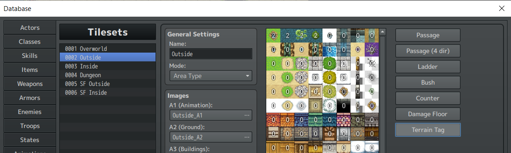
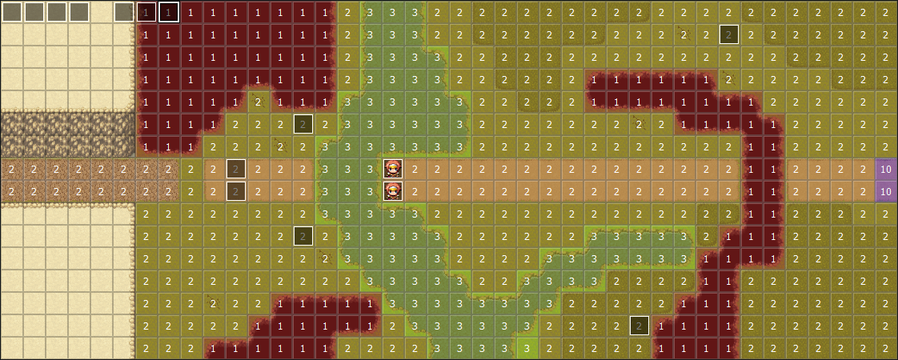
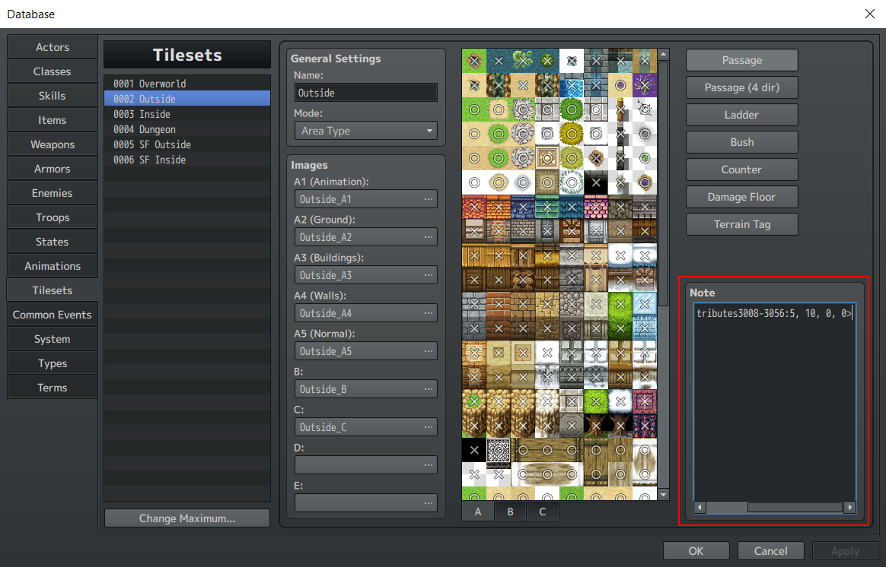
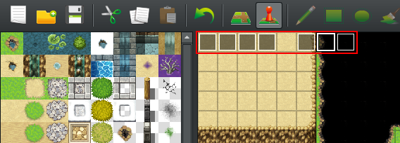

# SRW Engine MV User Manual V2.0

**NOTE: As of engine version v3.0 it is no longer possible to edit Pilot, Mech and Weapon properties using meta data tags, please see below for info on how to migrate an older version project and how to access the new editor.**

# Migrating a project from before v3.0

If you have a project from before v3.0, where custom editors for Pilots, Mechs and Weapons were introduced, please run the game once and opt-in to the automatic upgrade process. All your definitions will be upgraded to the latest format.

Then download the latest default assets bundle and extract it into the projects' root directory.

# Set-up

Extract the archive containing the sample project.<br>
In the project directory navigate to js/plugins/config and copy the "default" directory into a new "active" directory.
  
# Deploying a game

To deploy a release build of a SRW Engine MV game take the following steps:

* In RPG Maker select File > Deployment
	- **DO NOT** Exclude unused files
	- **DO NOT** enable encryption	

# Terrain

This engine reuses some properties of terrain available in vanilla RPG Maker to assign additional terrain functionality.

## Terrain Cost

The terrain cost of a tile determines how many tiles of movement will be subtracted when a unit moves over it. By default each tile traveled uses up one unit of tile movement but if a tile has a higher cost assigned, additional movement will be spent to cross the tile.<br>

The terrain cost is set using the Terrain Tag functionality of RPG maker. To access this functionality in the editor go to Tools>Database>Tilesets. Select a tile set and click on the Terrain Tag option. 



Each tile can be assigned a Terrain Tag between zero and seven. A value of seven means seven additional tiles of movement will be subtracted for moving over the tile and a value of zero means no additional cost will be incurred for moving over the tile.

Terrain Cost will not be applied to units that are in a flying state.

## Regions

Regions are given additional importance when using SRW Engine MV.<br>
Regions are used to assign one of the five terrain types to every tile of a map. When using the region editor each region id in a column will make a tile the same terrain, only the first five columns are used.

* Column 1: Not passable (id 0, 8, 16, etc.)
* Column 2: Air (id 1, 9, 17, etc.)
* Column 3: Land (id 2, 10, 18, etc.)
* Column 4: Sea (id 3, 11, 19, etc.)
* Column 5: Space (id 4, 12, 20, etc.)

Additionally the engine provides a plugin command(addMapRegionHighlight) to highlight all tiles of a region on the map and provides a script command(isActorInRegion, isEnemyInRegion) to check if an enemy or ally is currently in a specific region. See the section on Event Scripting for more into on these commands.

Example map:



Note the use of region id 10 to create a separate area of the map that is still Land terrain but that can be highlighted separately from the other Land terrain.

## Terrain bonuses

**!!It is generally easier to use the addRegionAttributes plugin command instead of modifying the tileset metadata!!**

Any tile in a tileset can be given modifiers for evasion, defense, HP regen and EN regen for units that stand on tiles of that type.<br>

Assigning these bonuses to a tile is done using metadata tags in the Note field of the tileset in the database.



Only tiles in tilesets A1-A5 and B are supported.<br>

There are two formats for the metadata. In this example the attributes assigned are: an increase of 5% to defense, and increase of 10% to evasion, 15% HP restored at the start of each turn and 20% EN restored at the start of each turn.

* \<srwTileAttributes2:5, 10, 15, 20\>: assigns attributes to tile id 2
* \<srwTileAttributes3008-3056:5, 10, 15, 20\>: assigns attributes to tile id 3008 up to but not including tile id 3056

The latter of the two formats is useful for assigning properties to autotiles.


For a detailed explanation on how to figure out the tile id of a tile [please refer to this tutorial.](https://forums.rpgmakerweb.com/index.php?threads/how-to-determine-your-tileid.91129/)


# Pilots

## General Notes

When making pilots it is important to remember that enemy and ally pilots should always be completely separate.<br>

If you have a character that appears as both throughout your game you must give them an entry as both an Ally and Enemy pilot.

## Ally Pilots

Launch the game and on the title screen hit F11 to access the built-in editor.

#### Base stats

* SP: is used to cast Spirit Commands.<br>
* Melee: Determines damage for Melee attacks.<br>
* Ranged: Determines damage for Ranged attacks.<br>
* Skill: Determines how often the until will perform a critical hit and how often a unit will take a critical hit.<br>
* Defense: Determines how much damage a unit takes.<br>
* Evade: Determines how likely enemy attacks are to hit.<br>
* Hit: Determines the unit's hit rate when attacking targets.<br>
* Terrain: Air, Sea, Land, Space. Determines the pilot's performance on these terrains.<br>
* Exp. yield: The exp yield listed here is the exp gained if the enemy defeated and the actor were at the same level. When the level is different the exp gain gets scaled accordingly.<br>
* PP yield: The amount of Pilot Points awarded for shooting down this unit.<br>
*  Tags:  Freeform tags applied to the pilot separated by commas. Can be used for battle text or for applying abilities.<br>


#### Stat growth rates


* A flat rate stat growth, at any given level the stat is calculated as: base\_stat + floor(level * growth\_rate) <br>
* A curve stat growth. The first parameter defines the stat's value at level 99 and the second parameter defines the growth rate. Growth rate is a value between -1 and 1, where -1 is fast growth and 
1 slow growth. <br>


#### Spirits

A pilot can have up to 6 spirits.<br>


#### Abilities

The ability learn list defines which abilities a pilot learns and at which level.

#### Personality

A pilot's personality determines how their Will changes when certain events occur. 


#### Relationships

Pilots can have certain relationships towards other pilots, these relationships will grant bonuses to the pilot when adjacent to those other pilots. The other pilots listed are the recipients of the bonuses, the unit itself does not receive any bonuses.


The effects of the relationship types are defined in RelationshipBonuses.conf.js

Ex.:

```
this.addDefinition(
	0, //the id of the bonus
	"Love", //the name of the bonus
	"Increases damage with level.", //the description of the bonus 
	function(actor, level){ //a function defining the effects granted by the bonus for each level
		var effects = [
			[{type: "final_damage", modType: "mult", value: 1.04}],
			[{type: "final_damage", modType: "mult", value: 1.08}],
			[{type: "final_damage", modType: "mult", value: 1.12}],
		];
		return effects[level];
	}
);

```

The setPilotRelationship plugin command can be used to update a pilot's relationships. 

## Enemy Pilots

Launch the game and on the title screen hit F11 to access the built-in editor. The properties are the same as for Ally Pilots.

# Mechs

## General Notes

Unlike in vanilla RPG Maker, the Class/Mech of the unit is what determines what their sprite will be on the map.

When working with Mechs a couple of important things must be kept in mind:

* Enemy and Ally Mechs must be kept separate at all times. If a Mech appears as both an Ally and Enemy unit in the game a separate entry must be made for when it used as an Ally and when it is used as an Enemy. 
* Never assign multiple Allied Pilots to the same Mech entry. If multiple copies of the same Mech need to be used by allied pilots, each copy must have its own entry. This restriction does not apply to Enemy mechs.

## Definition

Launch the game and on the title screen hit F11 to access the built-in editor.

### Base stats

* Primary Attribute: The primary attribute of the mech, used if ENABLE\_ATTRIBUTE\_SYSTEM is on.<br>
* Secondary Attribute: The secondary attribute of the mech, used if ENABLE\_ATTRIBUTE\_SYSTEM is on.<br>
* HP<br>
* EN: EN is consumed to perform some attacks.<br>
* Armor: Determines how much damage the mech takes from enemy attacks.<br>
* Mobility: Determines how likely the mech is to be hit by enemy attacks.<br>
* Accuracy: Determines how likely the mech is to hit enemies.<br>
* Terrain: Air,Land,Sea,Space. Determines the mech's performance on these terrains.<br>
* Move: Determines how many tiles the mech can move by default.<br>

* Size: Determines the size of the mech, which influences evasion and damage taken.<br>
* CanFly
* AirEnabled
* LandEnabled
* WaterEnabled: By default a unit will still only have half movement in water. Set it to "without penalty" option to give the units full movement in water.
* SpaceEnabled
* ExpYield: The exp yield listed here is the exp gained if the enemy defeated and the actor were at the same level. When the level is different the exp gain gets scaled accordingly.<br>
* PPYield<br>
* FundYield<br>
* Tags: Freeform tags applied to the mech separated by commas. Can be used for battle text or for applying abilities.<br>

### Upgrade costs

The upgrade costs for a mech's stats can be one of multiple types. The type defines how much each level of upgrades costs.

Cost types are defined in Engine.conf. Types are separate between regular stats and weapon upgrades.

### Upgrade amounts

For normal stats, upgrades will increase the stat by a fixed value for each level of upgrades. The defaults are:

HP: 350<br>
EN: 10<br>
Armor: 60<br>
Mobility: 5<br>
Accuracy: 6<br>

For weapons the upgrade amount per level is defined in the Weapon definition.


### Transform

Note: Transformation functionality is currently only available for Ally units.

Units can be given the ability to transform into other units.

Units can be given the ability to automatically transform into other units when they are destroyed.


Units can be given the ability to automatically transform into other units if another unit is present or missing on the map.  


### Combining Units

Units can be given the ability to combine into other units. Combined units have the ability to split back into their components. The combine command will be available in the unit menu if all required units are adjacent on the map.


### Inheriting upgrades and parts

When working with transforming or combining mechs it usually desirable for the upgrade levels of the transformed or combined mech to match those of the base mech and for parts to be synchronized as well.

Set the Sync With of a unit to sync its upgrades with another unit.


### Managing (Sub)Pilot Assignments 

Only applies to allied units.

Some mechs may be pilot-able by multiple pilots. Set the Allowed Pilots to defined which pilots these are.

A mech can have any number of sub-pilots. The spirit commands of the sub-pilots are usable by the unit as a whole.
The pilots listed in the database definition are the default sub-pilots for a unit.

Each sub pilot slot can be assigned a list of valid pilots. Up to 10 slots are supported:


Fore Pilots: If enabled the sub-pilots of the mech will always be set to the ones defined by the sub pilots tag. This property should be set on mechs that have sub-pilots that can be assigned to different units so that it will always have the correct sub-pilots when deployed.

### Deployment

#### Actions

Some mechs need to make sure pilots are in the correct spot before they can be used.

Set deploy actions to manage automatic pilot reassignments.

### Attacks

The attacks available to the mech. If locked the weapon will not show up in the weapon list be default.

### Abilities

A Mech can have up to 6 abilities and Full Upgrade Bonus ability.


### Items

A mech can have 1-4 item slots. An enemy mech will drop all items it is holding for the player to collect when defeated. The items held by enemies are defined when spawning the enemy.

### Sprite info 

Image files for the battle scene are stored in the img/SRWBattleScene directory with a sub directory for each character. The directory for each character contains a main.png image which is the image that is used for the Mech in the battle scene.

Settings are managed in the Battle Scene section of the Mech editor.

* Folder: The name of the sub directory in the img/SRWBattleScene folder that houses the image files for the Mech. <br>
* Sprite Type: Default, Spriter or Dragonbones
* Source Size: The height and width of the main.png image for this mech in pixels.<br>
* Y offset: If specified the main sprite for the unit will be offset by the given amount. The offset is specified in world units.
* Shadow Scale: The size of the shadow displayed for the mech in the battle scene.<br>
* Shadow Z Offset: The z offset for the shadow relative to the center point of the mech's sprite in the battle scene in world units.<br>
* Shadow X Offset: The x offset for the shadow relative to the center point of the mech's sprite in the battle scene in world units.<br>
* World Size The world space size of the Mech's sprite. This size is used for determining the size and position of the unit's barrier.<br>
* Death Animation: Specifies the id of a battle animation to be played when the mech is destroyed. If omitted the default death animation is used.

Each mech should have an image file for the default poses in its SRWBattleScene folder.
The required default poses are:

    main: Idle pose
    in: Leaning in while moving
    out: Leaning back while moving
    hurt
    dodge

For units that use regular sprites each of these default poses should have a matching .png file in the correct character folder(main.png, hurt.png, etc.)

### Basic Battle Sprite

Click the preview in the Basic Battle section to choose the basic battle sprite. Stored in img/basic_battle.

### Map Sprite

Click the preview in the Overworld section to choose the map sprite. Stored in img/characters in standard RPG Maker format.

### Menu Sprite

A separate menu sprite can be selected for a unit, the main battle scene sprite is used by default.
Click the sprite in the General Info section to select a menu sprite. If the default Sprite is being used "Using fallback!" will be shown below the Sprite preview.

### Spawn Animation

* Animation The name of the sprite sheet found in img/animations<br>
* Frame Size The width and height of the frames of the animation in pixels<br>
* Frames: The number of animation frames to use from the sprite sheet<br>
* Sheet Width: The width in frames of the sprite sheet<br>
* Animation Speed: The speed of the animation in frames spent for each frame of the animation<br>
* Change on frame: The frame of the animation on which the unit that is being spawned will become visible<br>
* Sound effect The sound effect that plays when spawning the unit<br>

### Destroy Animation

* Animation The name of the sprite sheet found in img/animations<br>
* Frame Size The width and height of the frames of the animation in pixels<br>
* Frames: The number of animation frames to use from the sprite sheet<br>
* Sheet Width: The width in frames of the sprite sheet<br>
* Animation Speed: The speed of the animation in frames spent for each frame of the animation<br>
* Change on frame: The frame of the animation on which the unit that is being spawned will become invisible<br>
* Sound effect The sound effect that plays when spawning the unit<br>


# Attacks

## Definition

Launch the game and on the title screen hit F11 to access the built-in editor.


* Animation: The battle scene attack animation id that will be played for this weapon. If no id is provided the default animation will play.<br>
* Type Ranged or Melee<br>
* Post Move: Enable to allow the weapon to be used after moving<br>
* Power<br>
* Min Range<br>
* Range:<br>
* HitMod: Boost to hit rate in percent<br>
* CritMod: Boost to crit rate in percent<br>
* Ammo: Total ammo for the weapon, -1 if the weapon does not use ammo<br>
* EN: EN cost for using the weapon, -1 if the weapon does not have a cost<br>
* Will: Will requirement for the weapon, -1 if there is no requirement<br>
* Terrain: If a terrain value is "-" the weapon cannot be used on enemies who are currently on a tile of that terrain.<br>

* The weapon upgrade type determines how much power the weapon gains when upgraded.
* Category: The particle type of the weapon: ex: missile, funnel, beam, gravity, physical. Can be any value.	
* Always counter: If enabled the weapon will always trigger a Counter on the enemy turn. <br>
* IsCounterOnly:  If enabled the weapon can only be used to counter attack. <br>
* HPThreshold: If set this weapon will only be usable when the user's HP falls below the specified value(percent). This property is also respected by the enemy AI.<br>
* IsAll:  If enabled this weapon is treated as an ALL weapon and will hit both targets when targeting a twin. A note will be shown in the attack list to identify the weapon as an ALL weapon.
* Primary Attribute: Used if ENABLE\_ATTRIBUTE\_SYSTEM is on. If defined it will be used instead of the attacking mechs primary attribute.<br>
* Secondary Attribute:Used if ENABLE\_ATTRIBUTE\_SYSTEM is on. If defined it will be used instead of the attacking mechs secondary attribute.<br>
 
Weapons can have up to 10 special effects.

If a weapon has a map attack Id assigned it will function as map attack, other wise it functions as a normal attack.

## Combinations Attacks

Combinations attacks are attacks that require other units with a matching attack to either be adjacent to the current attacker or present on the field before the attack can be used. When a Combination Attack is used all participants will take the EN or ammo cost for the attack.

If any combo weapons are defined the attack is treated as a Combo Attack.

A combination attack has the following properties:

* Type: If "Adjacent" the attack can only be used if units with all required combo weapons are adjacent to each other and the attacker. If "On Map" the other units can be anywhere on the map.<br>

* Required Weapons: Thee other weapons that are required for the attack. Only one weapon can be provide per unit, so if two weapons are required then 2 units will need to be available to provide them.

## MAP Attacks

Map attacks can be managed through the Weapon editor by selecting a map attack and clicking the Edit button in the Map Attack section.


# Spirit Commands

Spirit commands are buff, debuff and healing commands that units can use when taking their turn, but only before moving. Spirit commands can apply to the own unit, another ally, an enemy, all allies or all enemies. Spirit commands consume SP to be used, but the cost is not part of the base definition and is instead defined when they are assigned to a Pilot. This allows Spirit commands to have different costs depending on the user.

Spirit commands are managed in: js/plugins/config/active/Spirits.conf.js

[A list of default Spirit commands is available here.](default_spirits.md)


The format of a Spirit command definition is as follows:

```javascript
this.addDefinition(
		0, //the id of the spirit
		"Love", //the display name of the spirit
		"Commands Accel, Strike, Alert, Valor, Spirit, Gain and Fortune will take effect.", //the display description of the spirit
		function(target){ //the effect function of the spirit, target is the actor that will be affected by the spirit command
			$statCalc.modifyWill(target, 10);
			$statCalc.setSpirit(target, "accel");
			$statCalc.setSpirit(target, "strike");
			$statCalc.setSpirit(target, "alert");
			$statCalc.setSpirit(target, "valor");
			$statCalc.setSpirit(target, "spirit");
			$statCalc.setSpirit(target, "gain");
			$statCalc.setSpirit(target, "fortune");
		},
		"self", //the targeting type of the spirit: self, ally, ally_all or enemy_all
		function(actor){ //this function is used to determine if the spirit can be used
			var activeSpirits = $statCalc.getActiveSpirits(actor);
			return ( 
				$statCalc.canWillIncrease(actor) ||
				!activeSpirits.accel ||
				!activeSpirits.strike ||


				!activeSpirits.alert ||
				!activeSpirits.valor ||
				!activeSpirits.spirit ||
				!activeSpirits.gain ||
				!activeSpirits.fortune
			);
		}, 
		null, //this function is used to determine if the spirit can be used for any target. Only applicable for "ally" type spirits
		{ // info for the animation when the spirit is used
			src: "Love", //the name of the image file in img/animations/spirits
			duration: 800 //the duration of the animation in milliseconds
		}
	)
```

# Abilities and effects

There are several types of special abilities and effects in SRW Engine MV: Pilot abilities, Mech abilities, Item effects and weapon effects.

## Pilot Abilities

Pilot abilities are managed in js/plugins/config/active/PilotAbilities.conf.js

Pilot abilities can be assigned to pilots. These abilities can have levels and can level up as the pilot levels up. For more information on assigning abilities please check the section on Pilots.<br>  
  
Pilots have a special ability called an Ace Ability that is unlocked once the pilot has shot down a certain amount of enemies. Ace Abilities are defined as regular abilities with an additional check in their isActive function to verify that the pilot has reached Ace status. 

[A list of default Pilot Abilities is available here.](default_pilot_abilities.md)


The format of a Pilot Ability definition is as follows: 

```javascript
	this.addDefinition(
		4, //the id of the ability
		"Prevail", // the display name of the ability
		"Hit, Evade, Armor and Critical go up as HP decreases.", // the display description of the ability 
		true, // true if the ability has a level, otherwise false
		false, //true if the ability is unique, otherwise false. Unique abilities are marked with a \* when they are display and they cannot be purchased
		function(actor, level){//the function implementing the effect of the ability. Actor is the unit that will be affected by the ability and level is the current level of the ability.
			var mechStats = $statCalc.getCalculatedMechStats(actor);		
			var targetSlice = Math.floor(mechStats.currentHP / mechStats.maxHP * 10);
			var hitEvadeMod = (level - targetSlice) * 0.05;
			if(hitEvadeMod < 0){
				hitEvadeMod = 0;
			}
			var armorMod = (level - targetSlice) * 0.1;
			if(armorMod < 0){
				armorMod = 0;
			}
			var critMod = (level - targetSlice) * 0.08;
			if(armorMod < 0){
				armorMod = 0;
			}
			return [
				{type: "hit", modType: "addFlat", value: hitEvadeMod * 100},
				{type: "evade", modType: "addFlat", value: hitEvadeMod * 100},
				{type: "armor", modType: "addPercent", value: armorMod},
				{type: "crit", modType: "addFlat", value: critMod * 100},
			];
		},// the function that determines if the ability is current active.
		function(actor, level){
			var mechStats = $statCalc.getCalculatedMechStats(actor);	
			var targetSlice = Math.floor(mechStats.currentHP / mechStats.maxHP * 10);
			return (targetSlice + 1) <= level;
		},
		[20,30,40,50,60,70,80,90,100],// the cost for upgrading each level of the ability.
		9// the max level of the ability.
		, // the function that determines how the ability's name should be displayed. If a value of "on" is returned the ability's name will be displayed with a blue highlight, if a value of "off" is returned the name will be grayed out. For any other returned value the name will be displayed with the default color.
		function(actor, level){
			var mechStats = $statCalc.getCalculatedMechStats(actor);	
			var targetSlice = Math.floor(mechStats.currentHP / mechStats.maxHP * 10);
			return (targetSlice + 1) <= level ? "on" : "off";
		}
	)
```

By default an ability will only affect its holder, but an ability can be set to target allies and enemies in a range around the ability holder as well.

The following example implements the commander ability:

```
	this.addDefinition(
		44, //the id of the ability
		"Commander", // the display name of the ability
		"Grants a boost to evasion and accuracy to adjacent allies. Range and effectiveness depend on the skill level.", // the display description of the ability 
		true, // true if the ability has a level, otherwise false
		true, //true if the ability is unique, otherwise false. Unique abilities are marked with a \* when they are display and they cannot be purchased
		function(actor, level){ //the function implementing the effect of the ability. Actor is the unit that will be affected by the ability and level is the current level of the ability.
			var effects = [
				[//level 1
					{type: "hit", modType: "addFlat", value: 10, range: 1},{type: "evade", modType: "addFlat", value: 10, range: 1},
					{type: "hit", modType: "addFlat", value: 8, range: 2},{type: "evade", modType: "addFlat", value: 8, range: 2},
				],
				[//level 2
					{type: "hit", modType: "addFlat", value: 15, range: 1},{type: "evade", modType: "addFlat", value: 15, range: 1},
					{type: "hit", modType: "addFlat", value: 12, range: 2},{type: "evade", modType: "addFlat", value: 12, range: 2},
					{type: "hit", modType: "addFlat", value: 8, range: 3},{type: "evade", modType: "addFlat", value: 8, range: 3},

				],
				[//level 3
					{type: "hit", modType: "addFlat", value: 20, range: 1},{type: "evade", modType: "addFlat", value: 20, range: 1},
					{type: "hit", modType: "addFlat", value: 16, range: 2},{type: "evade", modType: "addFlat", value: 16, range: 2},
					{type: "hit", modType: "addFlat", value: 12, range: 3},{type: "evade", modType: "addFlat", value: 12, range: 3},
					{type: "hit", modType: "addFlat", value: 8, range: 4},{type: "evade", modType: "addFlat", value: 8, range: 4},
				],
				[//level 4
					{type: "hit", modType: "addFlat", value: 25, range: 1},{type: "evade", modType: "addFlat", value: 25, range: 1},
					{type: "hit", modType: "addFlat", value: 20, range: 2},{type: "evade", modType: "addFlat", value: 20, range: 2},
					{type: "hit", modType: "addFlat", value: 15, range: 3},{type: "evade", modType: "addFlat", value: 15, range: 3},
					{type: "hit", modType: "addFlat", value: 10, range: 4},{type: "evade", modType: "addFlat", value: 10, range: 4},
					{type: "hit", modType: "addFlat", value: 5, range: 5},{type: "evade", modType: "addFlat", value: 5, range: 5},
				],
			];
			
			return effects[level-1];
		},
		function(actor, level){ // the function that determines if the ability is current active.
			return true;
		},
		[0],//cost
		4,//max level
		null,//ability highlighting function, unused for this ability
		function(actor, level){//function that determines the range of the ability depending on level
			return {min: 1, max: 5, targets: "own"}
		},
		false //optional parameter, if false do not allow stacking of the ability with other instances of itself. Default true.
	);
``` 

And this example implements the Pressure ability:

```
	this.addDefinition(
		59, //the id of the ability
		"Pressure", // the display name of the ability
		"Increases damage dealt to and reduces damage taken from opponents within range whose SKL stats are lower. Effective range is twice the skill level. More effective at higher skill levels.", // the display description of the ability 
		true,// true if the ability has a level, otherwise false
		true, //true if the ability is unique, otherwise false. Unique abilities are marked with a \* when they are display and they cannot be purchased
		function(actor, level){ //the function implementing the effect of the ability. Actor is the unit that will be affected by the ability and level is the current level of the ability.
			var effects = [
				[//level 1
					{type: "final_damage", modType: "mult", value: 0.95}, {type: "final_defend", modType: "mult", value: 0.95},				
				],
				[//level 2
					{type: "final_damage", modType: "mult", value: 0.90}, {type: "final_defend", modType: "mult", value: 0.90},		
				],
				[//level 3
					{type: "final_damage", modType: "mult", value: 0.85}, {type: "final_defend", modType: "mult", value: 0.85},
				],
				[//level 4
					{type: "final_damage", modType: "mult", value: 0.80}, {type: "final_defend", modType: "mult", value: 0.80},
				],
			];			
			return effects[level-1];		
		},
		function(actor, level){
			var combatInfo = $statCalc.getActiveCombatInfo(actor);
			if(combatInfo){
				var ownPilotStats = $statCalc.getCalculatedPilotStats(combatInfo.self);
				var otherPilotStats = $statCalc.getCalculatedPilotStats(combatInfo.other);
				return ownPilotStats.skill > otherPilotStats.skill;
			} else {
				return false;
			}
		},
		[0],//cost
		4,//max level
		null,//ability highlighting function, unused for this ability
		function(actor, level){//function that determines the range of the ability depending on level			
			return {min: 1, max: (level*1 + 1) * 2, targets: "other"}
		}	
	);
```

## Mech Abilities

Mech abilities are managed in js/plugins/config/active/MechAbilities.conf.js

Mech Abilities are assigned to mechs and are normally part of the mech definition and cannot be changed. For more information on how Mech abilities are assigned please see the section on Mechs.

Mechs have a special ability called a Full Upgrade Bonus which is unlocked when a mech is fully upgraded. Full Upgraded Bonuses are defined in the same way as regular mech abilities but they have an additional check in their isActive function to verify that a unit is fully upgraded.

[A list of default Mech Abilities is available here.](default_mech_abilities.md)


The format of a Mech Ability definition is as follows:

```javascript
	this.addDefinition(
		0, // the id of the ability
		"Double Image", // the display name of the ability
		"30% chance to evade any attack above 130 Will.", // the display description of the ability
		false, // unused
		false, // unused
		function(actor, level){ //the function implementing the effect of the ability.
			return [{type: "double_image_rate", modType: "addFlat", value: 0.3}];
		},
		function(actor, level){ // the function that determines if the ability is current active.
			return $statCalc.getCurrentWill(actor) >= 130;
		}, // the function that determines how the ability's name should be displayed. If a value of "on" is returned the ability's name will be displayed with a blue highlight, if a value of "off" is returned the name will be grayed out. For any other returned value the name will be displayed with the default color.
		function(actor, level){
			return $statCalc.getCurrentWill(actor) >= 130 ? "on" : "off";
		}
	);

```

## Item Effects


Item effects are managed in js/plugins/config/active/ItemEffects.conf.js

Mechs can hold items that give them certain abilities. Some items are consumables that only apply their effect once consumed. Consumables return after a stage has been completed.

[A list of default Items is available here.](default_items.md)

The format of an Item Effect definition is as follows:

```javascript

	this.addDefinition(
		0, //the id of the item
		"Booster", // the display name of the item
		"Movement +1.", // the display description of the item
		false, // unused
		false, // true if the item is a consumable, otherwise false
		function(actor, level){ // the function implementing the effect of the item
			return [{type: "movement", modType: "addFlat", value: 1}];
		},
		function(actor, level){ // the function that determines if the item is usable, normally always returns true
			return true;
		}
	);

```

## Weapon Effects

Weapon effects are managed in js/plugins/config/active/WeaponEffects.conf.js

Weapons can have special effects that apply or that they inflict when used. 

[A list of default Weapon Effects is available here.](default_weapon_effects.md)

The format of a Weapon Effect definition is as follows:

```javascript

	this.addDefinition(
		0, // the id of the effect
		"Barrier Piercing", // the display name of the effect
		"Ignores barriers on the target.", // the display description of the effect
		false, // unused
		false, // unused
		function(actor, level){ // the function implementing the effect of the item
			return [{type: "pierce_barrier", modType: "addFlat", value: 1}];
		},
		function(actor, level){// the function that determines if the item is usable, normally always returns true
			return true;
		}
	);

```


## Ability Commands

Ability commands are managed in js/plugins/config/active/AbilityCommands.conf.js

Some pilot or mech abilities can grant the unit use of special Ability Commands. The properties of the Ability Commands are defined as follows:

```javascript

	this.addDefinition(
		0, //the id of the command
		"Chalice", //the display name of the command
		"Recover HP and EN to full up to twice per stage.", //the display description of the command
		2, //the number of times the ability can be used per stage
		function(actor){ //the function that applies the effect of the command to the user
			$statCalc.recoverHPPercent(actor, 100);
			$statCalc.recoverENPercent(actor, 100);
		}, function(actor){ //the function that checks if the command can be used
			return $statCalc.canRecoverEN(actor) || $statCalc.canRecoverHP(actor)
		},
		42 //the animation that should be played when the ability is used, -1 if none
	);	
F
```

The abilities that grant use of Ability Commands use the special "ability\_command" type. These can be any type of Ability, this is an example of a Mech ability that grants use of an Ability Command as a Full Upgrade Bonus:

```javascript
	this.addDefinition(
		37, 

		"Chalice",
		"Recover HP and EN to full up to twice per stage.",
		false,
		false,
		function(actor, level){
			return [
				{type: "ability_command", cmdId: 0},				
			];
		},
		function(actor, level){
			return $statCalc.isFUB(actor);
		}
	);	
```
# Event scripting

## Stage control events

This engine introduces a couple of specific event types that will run when the engine is in a specific state.<br>
Ex.: Start of a stage, after a unit made an action, etc.<br>
They can be found at the top left of the demo stages.



These events have a metadata tag indicating their type.<br>
Ex.: \<type:battleStart\><br>

It is recommended to create all new stages by creating a copy of a demo stage so that all the basics for these events are in place.

### battleStart

The battleStart event runs when the stage first starts. This event is used to set up the stage as well as to show any story events that should occur before the stage starts.<br>
It will normally have the following responsibilities:


* Set the battle environments for the map using the setDefaultBattleEnv, setSkyBattleEnv and setRegionBattleEnv commands

* Set the stage theme song using the setStageSong plugin command

* Set the enemy upgrade level using the setEnemyUpgradeLevel plugin command

* Set the stage victory, loss and mastery condition texts

* Spawn initial enemies using the this.addEnemy script command

* Play the stage BGM using the Play BGM command

* Fade in the screen from black using the FadeIn Screen command

* Showing the stage name using either a text command or by displaying an image

* Showing the stage conditions by using the this.showStageConditions script command

### actorTurn

The actorTurn event runs at the start of each actor turn. It can be used to have certain events occur at the start of a specific turn by using the Turns Passed(Stage) control variable.<br>
This command is also responsible for showing the next turn text using a formatted Text command.

### enemyTurn

The enemyTurn event runs at the start of each enemy turn. It can be used to have certain events occur at the start of a specific turn by using the Turns Passed(Stage) control variable.<br>
This command is also responsible for showing the next turn text using a formatted Text command.

### turnEnd

The turnEnd event runs at the end of a full turn (actor phase + enemy phase).

### beforeBattle

The beforeBattle event runs before each battle. The Actor Event ID, Enemy Event ID, Actor ID and Enemy ID control variables can be used to check which units are going to involved in the upcoming battle. This event can be used for before battle interactions between characters.

### beforeDestruction

The beforeDesctruction event will run after battle occurred but before any rewards are given and before any destroyed units play their destruction animations. The pending destruction of a unit can be canceled in this event. This event can be used to have bosses run away instead of being destroyed or to trigger defeat conditions if an ally unit will be destroyed.

### afterAction

The afterAction event runs every time a unit completes its turn. This is the event where checks for stage completion/loss requirements will usually will be done. It will then also contain scripting for the after stage story section, setting up deploys for the next stage and sending the player to the Intermission map. 

## Other event types

Events that are used for units can have special roles assigned to them using metadata as well.

* \<type: ship\>: Specifies that the event will be linked to a ship type unit. These events are used when automatically deploying ship units.
* \<type: ship_event\>: Specifies that the event will become a ship through a scripted deploy during the stage. These events are not used for automatic deployment. Events that will become ships must be tagged as such to ensure that they have proper z-indexing.
* \<type: actor\>: Specifies that the event will be linked to an actor pilot. These events become selectable positions when doing a manual deploy.

## Control Variables

The first two pages of Control Variables are reserved for specific functions in the engine:

* 0001 - Remaining Actors: The number of remaining actors on the stage. This variable is updated by the engine when allies are added or removed.
* 0002 - Remaining Enemies: The number of remaining enemies on the stage. This variable is updated by the engine when enemies are added or removed.
* 0003 - Turns Passed(Stage): The number of turns(one actor phase + one enemy phase) that has passed on the current stage.
* 0004 - Actor Event ID: The event ID of the current active actor


* 0005 - Enemy Event ID: The event ID of the current active enemy
* 0006 - Next Map: The id of the next map that will be loaded after the next intermission
* 0007 - Next Map X: The starting x coordinate for the cursor on the next map
* 0008 - Next Map Y: The starting y coordinate for the cursor on the next map
* 0009 - Next Deploy Info: Information for the deployment on the next map. Should be treated as read only!
* 0010 - SR Count: The total SR points earned by the player. This needs to be updated manually by the stage script when the player completes a mastery condition
* 0011 - Last stage ID: The ID of the previous stage.
* 0012 - Turn Count(Global): The total number of turns the player has taken across all stages
* 0013 - Actor ID: The actor ID of the current active actor. **When using the twin system the isActorInBattle or isEventInBattle command must be used instead!**
* 0014 - Enemy ID: The enemy ID of the current active enemy **When using the twin system the isEnemyInBattle or isEventInBattle command must be used instead!**
* 0015 - Actors Destroyed: The number of allies that were destroyed on the current stage
* 0016 - Enemies Destroyed: The number of  
* 0017 - Mastery Condition Text
* 0018 - Victory Condition Text
* 0019 - Defeat Condition Text
* 0020 - Ship Count: The current number of active ships on the stage

Variables 0021-0060 are stageTemp variables that can be used to keep track of things over the course of a single stage.<br>
<b>The engine will automatically clear these when a new stage starts!</b>

Page 4 and 5 of the Control Variables have been made reserved for specific functions in the engine after more variables became necessary. Currently the following Variables are available:

* 0061 - lastActorAttackId: The ID of the attack used by the actor in the most recent battle.
* 0062 - lastActorSupportAttackId: The ID of the attack used by the actor support attacker in the most recent battle.
* 0063 - lastEnemyAttackId: The ID of the attack used by the enemy in the most recent battle.

* 0064 - lastEnemySupportAttackId: The ID of the attack used by the enemy support attacker in the most recent battle.

## Switches

<b>The first page of switches is reserved for engine specific functions and should not be used!</b>

## Plugin commands


* SRPGBattle start|end

	This command starts or ends the SRPG mode of the engine.<br>
	Generally only called by the init or intermission map to start a new stage.
	
* Intermission start|end

	This command starts or end the intermission. Only called on the intermission map.

* unlockUnit class\_id
	Make the mech with the specified id available to the player.

* lockUnit class\_id
	Make the mech with the specified id not available to the player.
	
* assignUnit actor\_id class\_id
	Assign the mech with the specified id to the pilot with the specified id.	

* SetLevel actor\_id level

* addKills actor\_id amount

* addPP actor\_id amount

* addExp actor\_id amount
		
* setStageSong song_id

	Sets the default song for the current stage.<br>
	When switching between actor and enemy phases this song will start playing.

* setSpecialTheme song\_id
	
	If set this song will override actor or enemy songs.
	
* clearSpecialTheme

* addItem item_id

	Adds one of the specified item to the inventory.
	
* addAllItems

	Adds one of each existing item to the inventory.
			
* removeItem
	Removes one of the specified item from the inventory.	

* addItemToHolder item\_id mech\_id slot

	Assigns an item to be held to a mech in a specific slot.<br>
	Will unequip any item previously held for that mech and slot.<br>
	Will fail if no free items of the type are available in the inventory!

* removeItemFromHolder mech\_id slot

* setFreeEventCam

	Sets the event cam to free mode until clearFreeEventCam is called. In free mode focusEvent and focusActor commands will not center the camera on the target unit.<br>
	focusEvent and focusActor commands that specify a free\_camera mode override this setting.<br>
	Does not persist across stages and reloads. 	
	
* clearFreeEventCam

	Sets the event cam to fixed mode until setFreeEventCam is called. In fixed mode focusEvent and focusActor commands center the camera on the target unit.<br>
	focusEvent and focusActor commands that specify a free\_camera mode override this setting.<br>
	Does not persist across stages and reloads. 		
	
* focusActor actor\_id free\_camera

	If an actor with the specified id exists on the map the cursor will be set to its position.<br>	
	If free\_camera is 1 the camera will not move with the cursor.<br>	
	If the matching actor does not exist or the actor was erased, nothing happens. 
	
* focusEvent event\_id free\_camera

	If an event with the specified id exists on the map the cursor will be set to its position.<br>
	If free\_camera is 1 the camera will not move with the cursor.<br>
	If the matching actor does not exist or the actor was erased, nothing happens.<br>
	
* focusEnemy enemy\_id free\_camera

	If an enemy with the specified id exists on the map the cursor will be set to its position.<br>
	If free\_camera is 1 the camera will not move with the cursor.<br>
	If the matching enemy does not exist or the enemy was erased, nothing happens.<br>
	If an enemy id for an enemy type that exists multiple times on the map is used the enemy with the lowest event id will be selected.
	
* clearDeployInfo

	Clears the current set info to the default settings.

* populateDeployList
	
	Updates the deploy list to reflect newly added or removed units and pilots. **Must be used if the unlocks are changed in a stage before a deploy command is used!**	

	Clears all previous deploy info, should be used before setting up all the deploys for a map.

* setDeployCount amount

	Set the total number of particpants for the next deployment, ships not included.
	
* setMinDeployCount	count

	Set the minimum amount of units that should be deployed(default 1). Includes fixed deploy slots. Can be used on stages where the fixed deploy slots are not spawned immediately to make sure the player deploys at least x number of regular units.
	

* assignSlot slot actor\_id
	
	Assign an actor to a slot for the next deployment.
	Indirect id assignment is possible by providing the actor\_id in the form of \<game_variable\>. If provided in this format the assigned actor will be the number stored in the provided variable.
	
	Example:
	
	◆Control Variables：#0065 testVariableActorId = 1<br>
	◆Plugin Command：assignSlot 0 <65>

	This example first sets game variable 65 to a value of 1 and then assigns the content of that variable to slot 0. The end result is that actor 1 is assigned to slot 0.
	
* assignSlotSub slot actor\_id
	Assign an actor to the subtwin position of a slot for the next deployment. Indirect id assignment is possible by providing the actor\_id in the form of \<game_variable\>.

* assignShipSlot slot actor\_id
	
	Assign an actor to a ship slot for the next deployment.	<br>
	This actor should logically be a ship captain, but this is not strictly enforced.
	
* lockDeploySlot slot

	Prevent the player from changing a deploy slot in the intermission menu.<br>

	Units required for events after the next deploy should be assigned to a slot and then have that slot be locked.	
	
* unlockDeploySlot slot

* disableDeploySlot slot

	Prevent a deploy slot from being deployed during a manual deploy. The unit in the slot will not show up during the rearranging phase of the manual deploy. Should always be combined with a locked slot!
	
* enableDeploySlot slot	
	
* lockShipDeploySlot slot

	Prevent the player from changing a ship deploy slot in the ship selection menu.<br>

	Units required for events after the next deploy should be assigned to a slot and then have that slot be locked.	
	
* unlockShipDeploySlot slot
		
	
* addMapHighlight x y color

	Highlight the tile on the map with the specified coordinates and color.<br>
	Color can be a string name, ex.: "white"	
	
* removeMapHighlight x y 

* addMapRegionHighlight region_id color

	Highlight all tiles on the map that are within the specified region.<br>
	Color can be a string name, ex.: "white"	

	
* removeMapRegionHighlight

* setEnemyUpgradeLevel level
	Sets the upgrade level for all enemies that will appear on the current stage.
	
* addPersuadeOption actor\_id event\_id var\_id

	Adds the option to use the persuade command for the actor with the specified id when they are adjacent to the 	specified event. After using the persuade option the Control Variable with the specified id will be set to 1,  	which can then be checked for in the afterAction event to implement the conversation.	

* removePersuadeOption actor\_id event\_id

	Removes the specified persuade option. This command should be called after the conversation has occurred if 		the conversation is supposed to be one time only. 

* deployShips toAnimationQueue

	Deploys all ships according to the current deploy info. If toAnimationQueue is set to true the this.processUnitAppearQueue() command will need to be called to show the unit.

* deployAll toAnimationQueue

	Deploys all allies according the current deploy info. If toAnimationQueue is set to true the this.processUnitAppearQueue() command will need to be called to show the unit.

* deployAllLocked toAnimationQueue

	Deploys all allies that are in a locked slot according to the current deploy info. If toAnimationQueue is set to true the this.processUnitAppearQueue() command will need to be called to show the unit.

* deployActor actor\_id event\_id toAnimationQueue sub\_id

	Deploys the specified actor to the specified event. If toAnimationQueue is set to 1 the this.processUnitAppearQueue() command will need to be called to show the unit.
If a sub\_id is specified the specified actor will be deployed as the sub twin for the unit.
 
* deploySlot slot toAnimationQueue

	Deploys the actor in the specified slot according to the current deploy info. If toAnimationQueue is set to 1 the this.processUnitAppearQueue() command will need to be called to show the unit.

* redeployActor actor\_id toAnimationQueue

	Deploys the actor with the specified id again. This can be used to update the actor's unit on the map after a class change. If toAnimationQueue is set to 1 the this.processUnitAppearQueue() command will need to be called to show the unit.

* moveEventToPoint event\_id x y follow no\_wait respect\_collision

	Move the specified event to the specified coordinates on the map. A route is automatically generated in the same way as when moving a unit on the map. Script execution is paused while the event is moving. If follow is 1 the cursor and camera will follow the event as it moves. Only one event of this type can run at the same time. If no\_wait is 1 script execution will not wait for the unit to move to continue. If respect\_collision is 1 the unit moved will move while respecting the collision of the terrain.

* storeEventPoint event\_id

	Stores the current position of the event with the specified id for later use with the moveEventToStoredPoint command. 
	The point is not stored across save file loads and should be used within the same event!
	
* moveEventToStoredPoint event\_id follow no\_wait respect\_collision

	Moves the event with the specified id to the last position stored for that id with the storeEventPoint command.  A route is automatically generated in the same way as when moving a unit on the map. Script execution is paused while the event is moving. If follow is 1 the cursor and camera will follow the event as it moves. Only one event of this type can run at the same time. If no\_wait is 1 script execution will not wait for the unit to move to continue. If respect\_collision is 1 the unit moved will move while respecting the collision of the terrain.
	
* moveActorToPoint actor\_id x y follow no\_wait respect\_collision

	Move the specified actor to the specified coordinates on the map. A route is automatically generated in the same way as when moving a unit on the map. Script execution is paused while the event is moving. If follow is 1 the cursor and camera will follow the event as it moves. Only one event of this type can run at the same time. If no\_wait is 1 script execution will not wait for the unit to move to continue. If respect\_collision is 1 the unit moved will move while respecting the collision of the terrain.
	
* moveEventToEvent event\_id target\_event\_id follow no\_wait respect\_collision

	Move the specified event adjacent to the specified event. A route is automatically generated in the same way as when moving a unit on the map. Script execution is paused while the event is moving. If follow is 1 the cursor and camera will follow the event as it moves. Only one event of this type can run at the same time. If no\_wait is 1 script execution will not wait for the unit to move to continue. If respect\_collision is 1 the unit moved will move while respecting the collision of the terrain.
	
* moveActorToEvent actor\_id target\_event\_id follow no\_wait respect\_collision

	Move the specified actor adjacent to the specified event. A route is automatically generated in the same way as when moving a unit on the map. Script execution is paused while the event is moving. If follow is 1 the cursor and camera will follow the event as it moves. Only one event of this type can run at the same time. If no\_wait is 1 script execution will not wait for the unit to move to continue. If respect\_collision is 1 the unit moved will move while respecting the collision of the terrain.
	
* moveEventToActor event\_id target\_actor\_id follow no\_wait respect\_collision

	Move the specified event adjacent to the specified actor. A route is automatically generated in the same way as when moving a unit on the map. Script execution is paused while the event is moving. If follow is 1 the cursor and camera will follow the event as it moves. Only one event of this type can run at the same time. If no\_wait is 1 script execution will not wait for the unit to move to continue. If respect\_collision is 1 the unit moved will move while respecting the collision of the terrain.
	
* moveActorToActor actor\_id target\_actor\_id follow no\_wait respect\_collision

	Move the specified actor adjacent to the specified actor. A route is automatically generated in the same way as when moving a unit on the map. Script execution is paused while the event is moving. If follow is 1 the cursor and camera will follow the event as it moves. Only one event of this type can run at the same time. If no\_wait is 1 script execution will not wait for the unit to move to continue. If respect\_collision is 1 the unit moved will move while respecting the collision of the terrain.

* setEventFlying event\_id

	Put the specified event into a flying state if the unit is capable of flight.

* setEventLanded event\_id

	Put the specified event into a grounded state.


* enableFaction faction\_id

	Enables the specified faction. Faction 0 is for standard enemies and is enabled by default. Factions 1 and 2 are additional factions whose aggro can be configured with other commands. Enemies spawned as those other factions will only take their turns if the correct faction is enabled.

* disableFaction faction\_id

	Disables the specified faction.

* setFactionAggro faction\_id targets

	Set the aggro for the specified faction. Targets should be in the following format, ex.: 
["player",0,2]. This example will make members of the specified faction aggressive towards player units and units of faction 0(default enemies) and faction 2.

* clearFactionAggro faction\_id

	Clears all current faction aggro settings for the specified faction.

* transformEvent event\_id idx no\_sfx

	Transforms the event with the specified id into the transformation with the specified index. The unit for the event should be able to transform! If no\_sfx is 1 no transformation sfx is played.

* combineEvent event\_id

	Combine the event with the specified id. The unit for the event should be able to combine and the other members of the combination should be deployed for best results.

* splitEvent event\_id 

	Split the event with the specified id. The unit  for the event should be a combined unit and the members of the combination should have been deployed on the stage before for best results.

* transformActor actor\_id idx

	Transforms the actor with the specified id into the transformation with the specified index. The unit for the actor should be able to transform!
	
* transformActorDirect actor\_id mech\_id

	Transforms the unit of the actor with the specified id into the specified mech\_id. Note that no checks on the validity of the transformation are performed.
	
* combineActor actor\_id

	Combine the actor with the specified id. The unit for the actor should be able to combine and the other members of the combination should be deployed for best results.

* splitActor actor\_id 

	Split the actor with the specified id. The unit for the actor should be a combined unit and the members of the combination should have been deployed on the stage before for best results.

* separateActor actor\_id

	Separate any twin the specified actor is currently part of.
	
* makeActorMainTwin actor\_id

	Make the specified actor the main twin if they are currently a sub twin.

* preventActorDeathQuote actor\_id 

	Prevents the default death quote from being played by making isActorDestructionQueued return false for the specified actor\_id. Only applicable in the beforeDestruction event.


* setSaveDisplayName name

	Set the name that will show up in the save file list for newly saved files. Spaces should be replaced by underscores in the command, ex.: "Debug\_Stage\_1" becomes "Debug Stage 1" on the file select screen.
	
* setStageTextId id

	Set the special text id for text on this stage. See the chapter on the Battle Text Editor for more info on special text.

* setEventWill event\_id amount
	


	Set the will of the unit for the specified event.
	
* setEventWillOverflow	event\_id amount 

	Set a new cap for the event's Will for the duration of the stage.

* setActorWill actor\_id amount
	
	Set the will of the actor unit with the specified id.
	
* makeActorAI actor\_id
	
	Make the actor with the specified ID AI controlled.
	
* makeActorControllable actor\_id

	Make the actor with the specified ID controllable by the player.	

	
* setActorEssential actor\_id
	
	Mark the actor with specified ID as essential. Essential actors can not board ships.
	
* setActorNonEssential actor\_id
	
	Mark the actor with specified ID as non-essential.		
	
* setEventMapCooldown event\_id turns
	
	Set the number of regular attack between MAP attack for the unit for the specified event.
	
* setDefaultBattleEnv env\_id
	
	Set the default battle environment for the stage to the specified environment id.
	

* setSkyBattleEnv env\_id


	Set the sky battle environment for the stage to the specified environment id.
	
* setRegionBattleEnv region\_id env\_id

	Set the standard battle environment for all tiles in the specified region to the specified environment id.		

* setRegionSkyBattleEnv region\_id env\_id

	Set the sky battle environment for all tiles in the specified region to the specified environment id.

* addRegionAttributes region\_id defense\_boost evasion\_boost hp\_regen en\_regen 

	Register terrain attributes for a specific region. All buff values are provided as percentages. 
	
	Ex.: addRegionAttributes 2 5 10 15 20 : Set the terrain attributes for region 2 to 5 percent defense buff, 10 percent evasion buff, 15 percent HP recovered at the start of each turn and 20 percent EN recovered at the start of each turn.

	The registered attributes will take priority over tileset attributes and will persist to the next stages. To clear them set all attributes to 0 or use the resetRegionAttributes command.
	
* resetRegionAttributes region\_id

	Remove all terrain attributes registered with the addRegionAttributes command for the specified region. Tileset attributes will take effect again if the tiles for the specified terrain had any.

* unlockMechWeapon mech\_id weapon\_id

	Set the weapon with the specified id as unlocked for the mech/class with the specified id.


*  lockMechWeapon mech\_id weapon\_id

	Set the weapon with the specified id as locked for the mech/class with the specified id.
	
* setUnlockedUpgradeLevel level

	Sets the allowed max level of upgrades to the specified level. Does not remove upgrades that go above the newly specified level.
	
* setRequiredFUBLevel level

	Sets the minimum level to which each stat should be upgraded before the Full Upgrade Bonus of mechs unlocks.
	
* setEventCounterAction event\_id type

	Sets the counter action of the unit for the specified event to the provided type. Possible values are: "attack", "defend", "evade", "defend\_low", "evade\_low" and "survive". The defend\_low and evade\_low will cause the unit to perform the defined action when at or below 25% HP, otherwise they will counter attack. If no value is set the unit will default to counter attacking.	
	
* setEventAttackAction event\_id type
	If set to "none" the unit will never initiate an attack on their turn.

* setEventBattleMode event\_id type

	Set the battle mode for the event with the specified event id. If the event is an enemy unit the following modes are available: "stand" for stationary enemies that start moving once provoked, "fixed" for enemies that will never move but will still attack units in range, "disabled" for units that will never act or counterattack, otherwise "". If the event is an actor unit only "disabled", "fixed" and "" are available.<br>
	If the enemy is part of a squad their squad mates will also be updated!
	
* hidePilotAbility actor\_id ability\_id

	Set the specified ability to hidden for the specified actor. A hidden ability will not have its name displayed.
		
* lockPilotAbility actor\_id ability\_id


	Set the specified ability to locked for the specified actor. A locked ability will not have its name displayed and its effect will not activate.	
		
* unlockPilotAbility actor\_id ability\_id

* setPilotAbilityUpgrade base\_idx upgraded\_idx

	Effectively replace the pilot ability with base\_idx with the ability with upgraded\_idx
		
* hideMechAbility mech\_id ability\_id

	Set the specified ability to hidden for the specified mech/class. A hidden ability will not have its name displayed.
		
* lockMechAbility mech\_id ability\_id

	Set the specified ability to locked for the specified mech/class. A locked ability will not have its name displayed and its effect will not activate.	
		
* unlockMechAbility mech\_id ability\_id

* setMechAbilityUpgrade base\_idx upgraded\_idx

	Effectively replace the mech ability with base\_idx with the ability with upgraded\_idx

* setMechUpgradeLevel mech\_id level force

	Set the upgrade level for all stats of the specified mech/class to the specified level. By default the upgrade level will not be applied if the mech already has a better upgrade level for a stat but if force is 1 all previous upgrades will be overwritten. 
	
* setPilotRelationship pilot\_id other\_pilot\_id bonus\_id level

	Set the relationship bonus for the pilot specified by other\_pilot\_id to the specified bonus and level when adjacent to the pilot specified by pilot\_id. Note that levels start at 0!

* lockTransformation mech\_id index

	Locks the Transform option with the specified index for the mech with the specified id.
	
* lockAllTransformations

	Locks the Transform option for all mechs.	
		
* unlockTransformation mech\_id

	Unlocks the Transform option with the specified index for the mech with the specified id.

* unlockAllTransformations

	Unlocks the Transform option for all mechs.	
	

* lockCombine mech\_id

	Locks the Combine option for the mech with the specified id.
	
* lockAllCombines

	Locks the Combine option for all mechs.	
		
* unlockCombine mech\_id

	Unlocks the Combine for the mech with the specified id.

* unlockAllCombines

	Unlocks the Combine option for all mechs.		
	
* setFaceAlias face\_name\_original face\_name\_translated

	Sets a face alias. When a face name specified by face\_name\_original is aliased it will be replaced by face\_name\_translated when fetching the face image. This can be used to more easily manage variable characters, such as when protagonist selection is implemented.
	
* showTargetingReticule start\_event\_id target\_event\_id
		
	Display the targeting reticle moving from the event with the provided start\_event\_id to the event with the provided target\_event\_id.
	Both parameters can also be provided in the form actor:actor\_id instead, example:
	
	showTargetingReticle 9 actor:3 Show the reticle moving from event 9 to the current position of actor 3
	
	Note that script execution is not halted while the reticle is shown, use the wait command if needed.

Also note that only one reticle can be shown at a time.

* clearTile x y event\_id actor\_id	

	Move any unit that is currently on the specified tile to a nearest free space. If event\_id or actor\_id is specified an event matching either of those ids will not be moved. This is to prevent a unit that is already in the correct spot from getting juggled around.
	
* clearAdjacentToTile x y include\_diagonal

	Move any unit that is currently adjacent to the specified tile to a free space. Spaces that make it look like the unit was pushed away are preferred.
	
* clearAdjacentToEvent event\_id include\_diagonal

	Move any unit that is currently adjacent to the specified event to a free space. Spaces that make it look like the unit was pushed away are preferred.	
	
* clearAdjacentToActor actor\_id include\_diagonal

	Move any unit that is currently adjacent to the specified actor to a free space. Spaces that make it look like the unit was pushed away are preferred.	
	
* stopSkipping


	A command that ensures auto skipping stops. Normally not needed as important commands will stop auto skipping by themselves.	
	
* setEventAIFlags event\_id terrain formation reposition

	Sets AI behavior for the unit with the specified event\_id. Valid flags values are 0 and 1.
	* terrain: if 1 the unit will prefer to move onto tiles that grant terrain bonuses
	* formation: if 1 the unit will prefer to move adjacent to allies that provide support attack/defend
	* reposition: if 1 the unit will move closer to hit enemies with stronger attacks even if they already can hit a target with a longer range attack
	* preferTarget: if 1 the unit will prefer to move closer to its target unit or region. Target units take priority over target regions.	
	
* setTerrainMoveCosts air\_cost land\_cost water\_cost space\_cost

	Set the cost in points of EN for moving on each terrain type. Once set the settings apply to all future stages until the command is used again. Defaults to all 0.
	
* setCloudScrollImage image
	
	Set the current image used for the scrolling clouds layer. It should be the name of a .png file in img/parallaxes.

* setCloudScrollXSpeed speed

	Set the horizontal speed of the scrolling clouds layer. 1-2 usually recommended.

* setCloudScrollYSpeed speed

	Set the vertical speed of the scrolling clouds layer. 1-2 usually recommended.
	


* setDefaultFocusEvent event\_id

	Set the default event that will be focused if the actor for a focusActor command is not deployed. This setting is remembered until changed by this command.

* setDefaultFocusActor actor\_id

	Set the default actor that will be focused if the actor for a focusActor command is not deployed. This take priority over any default event focus setting. This setting is remembered until changed by this command.
	
* lockCameraToCursor

	After using this command the camera will always center on the cursor when it is moved. Can be used when doing scripted movements. Should be turned off again using the 'unlockCameraFromCursor' command. Does not override the Does not persist after reloading the game(use the LOCK\_CAMERA\_TO\_CURSOR engine setting instead).	
	
* unlockCameraFromCursor

	Reverts the state set by the 'lockCameraToCursor' command. Does not override LOCK\_CAMERA\_TO\_CURSOR if that setting is enabled.	
	
* setAllyWillCap will

	Set the maximum will an ally unit can have. In effect until canceled by the 'clearAllyWillCap' command.
	
* clearAllyWillCap

	Sets the maximum will for allies back to the default.	
	
* setEnemyWillCap will

	Set the maximum will an enemy unit can have. In effect until canceled by the 'clearEnemyWillCap' command.
	
* clearEnemyWillCap

	Sets the maximum will for enemies back to the default.	
	
* setTerrainSolidForEnemy terrain\_id
	
	Sets the terrain with the specified id as impassable for enemy units. In effect until explicitly cleared0	
		
* setTerrainPassableForEnemy

	Sets the terrain with the specified id as passable for enemy units. Does not override standard terrain passibility for units!
	
* refundMechUpgrades mech\_id 
	
	Refunds all upgrades for the mech with the specified id and sets them to zero.		

* refundPilotPP pilot\_id
	
	Refunds all upgrades for the pilot with the specified id and sets them to zero.	Also removes any abilities learned through level up.	

* setActorSong actor\_id song\_name

	Sets the battle song for the actor with the specified id to the specified song name.	
	
* setActorWeaponSong actor\_id weapon\_id song\_name
	
	Sets the battle song for the actor with the specified id when using the weapon with the specified id to the specified song name.	
	
* addFunds amount

	Adds the specified amount to the player's funds.
	
* addSubPilot mech\_id  slot actor\_id

	Sets the specified actor as a subpilot for the specified mech in the specified slot(starts at 0).
	
## External Plugin commands	

These are plugin commands provided by external plugins.

### Tile Changer (Shaz_TileChanger.js)


* CopyTiles dx dy source sx1 sy1 sx2 sy2 z-list

	Copies tiles from another (or the same) map, where:

	 *   dx      is the x-coordinate of the top left destination area
	 *   dy      is the y-coordinate of the top left destination area
	 *   source  is the 'name' of the source map in the map note or 'self' if you want to copy a section of the current map
	 *   sx1     is the x-coordinate of the top left source area
	 *   sy1     is the y-coordinate of the top left source area
	 *   sx2     is the x-coordinate of the bottom right source area
	 *   sy2     is the y-coordinate of the bottom right source area
	 *   z-list  is an optional series of z values indicating which layers to copy. if more than one, just use spaces between. if omitted, all layers will be copied
	 


* ChangeTile x y z tileId

	 Changes the tile at the specified coordinates and layer to the tileId
	 indicated.  Note - no auto-formatting of autotiles happens here.
	 
```	
	Additional info:
		Z-layers:		
			* 0 - ground layer (most A tiles)
			* 1 - ground cover layer (A1 tiles with transparent areas, and right 4 columns of A2 tiles)
			* 2 - upper layer 1
			* 3 - upper layer 2
			* 4 - shadow layer
			* 5 - region layer
```

## Script commands

These added commands can be used in Script commands while making event scripts.<br>
They can also be used as conditionals in IF statements.

* this.setMasteryText(text)

	The text for "Win condition", "Defeat condition" and "Mastery condition" will be automatically printed and should not be included.
	
* this.setVictoryText(text) 

	The text for "Win condition", "Defeat condition" and "Mastery condition" will be automatically printed and should not be included.

* this.setDefeatText(text)  

	The text for "Win condition", "Defeat condition" and "Mastery condition" will be automatically printed and should not be included.
	
* this.showStageConditions()

	Shows a text box using the values set with the previous commands.
	
* this.isActorDestructionQueued(actor\_id)

	To be used as a conditional in the before_destruction event.<br>
	Will be TRUE if the actor with the specified id was defeated and is about to be destroyed.
	
* this.isEnemyDestructionQueued(enemy\_id)

	To be used as a conditional in the before_destruction event.<br>
	Will be TRUE if the enemy with the specified id was defeated and is about to be destroyed.
	
* this.isEventDestructionQueued(event\_id)


	To be used as a conditional in the before_destruction event.<br>
	Will be TRUE if the event with the specified id was defeated and is about to be destroyed.	

	
* this.isActorBelowHP(actor\_id, amount)

	Can be used as a conditional in the before\_destruction or after\_action event.<br>
	Will be TRUE if the HP of the actor with the specified id is below or equal to the specified value.
	<br>
	If actor\_id is -1 the condition is TRUE if any actor on the map meets the condition.
	
* this.isEnemyBelowHP(enemy\_id, amount)

	Can be used as a conditional in the before\_destruction or after\_action event.<br>
	Will be TRUE if the HP of the actor with the specified id is below or equal to the specified value.<br>
	If enemy\_id is -1 the condition is TRUE if any enemy on the map meets the condition.

* this.isEventBelowHP(event\_id, amount)

	Can be used as a conditional in the before\_destruction or after\_action event.<br>
	Will be TRUE if the HP of the actor with the specified id is below or equal to the specified value.
	
	
* this.isActorBelowHPPercent(actor\_id, percent)

	Can be used as a conditional in the before\_destruction or after\_action event.<br>
	Will be TRUE if the HP of the actor with the specified id is below or equal to the specified value.<br>
	If actor\_id is -1 the condition is TRUE if any actor on the map meets the condition.
	
* this.isEnemyBelowHPPercent(enemy\_id, percent)

	Can be used as a conditional in the before\_destruction or after\_action event.<br>
	Will be TRUE if the HP of the actor with the specified id is below or equal to the specified value.

* this.isEventBelowHPPercent(event\_id, percent)

	Can be used as a conditional in the before\_destruction or after\_action event.<br>
	Will be TRUE if the HP of the actor with the specified id is below or equal to the specified value.

* this.cancelActorDestruction(actor\_id, update\_count) 


	Cancel the destruction animation and erasure of an actor that is about to be destroyed.<br>
	If update\_count is true the unit will still count as defeated, this should be used if the unit respawns as a different faction after being destroyed.<br>
	To be used in the before_destruction event.
	
* this.cancelEnemyDestruction(enemy\_id, update\_count) 

	Cancel the destruction animation and erasure of an enemy that is about to be destroyed.<br>
If update\_count is true the unit will still count as defeated, this should be used if the unit respawns as a different faction after being destroyed.<br>
	To be used in the before_destruction event.<br>

	This can be used for bosses that run away when destroyed etc.

* this.cancelEventDestruction(event\_id, update\_count) 

	Cancel the destruction animation and erasure of an event that is about to be destroyed.<br>
If update\_count is true the unit will still count as defeated, this should be used if the unit respawns as a different faction after being destroyed.<br>
	To be used in the before_destruction event.<br>
	This can be used for bosses that run away when destroyed etc.

* this.addEnemy(toAnimQueue, eventId, enemyId, mechClass, level, mode, targetId, items, squadId, targetRegion, factionId, counterBehavior, attackBehavior)

	Spawn an enemy on the map, the event that will be used must already exist.<br>
	The following can be set:<br>
	* toAnimQueue: if 1 the enemy will not be spawned right away, but stored until the processEnemyAppearQueue command is called. If 0 the enemy appears instantly.
	* eventId: the id number of the event
		<br>
	* enemyId: the id number of the enemy pilot 
		<br>
	* mechClass: the id number of the mech/class for the enemy
		<br>
	* level
		<br>
	* mode: "stand" for stationary enemies that start moving once provoked, "fixed" for enemies that will never move but will still attack units in range, "disabled" for units that will never act or counterattack, otherwise ""
		<br>
	* targetId: the actor id of the actor this enemy should prioritize
		<br>
	* items: an array with the id numbers of the items the enemy will hold. Ex.: [10] or [10,11]. The first item in the list will drop from the enemy when it is defeated.
		<br>
	* squadId: all enemies that are assigned the same squad id will be activated if any member of the squad is activated <br>
	* targetRegion: the id of the region that the enemy should move towards<br>	
	* factionId: the id of the faction the unit will be assigned to. Factions 0, 1 and 2 are available with faction 0 being the default enemy faction. If omitted units will be assigned to faction 0.	
	* counterBehavior: Determines how an enemy will react to being attack. Possible values are: "attack", "defend", "evade", "defend\_low", "evade\_low" and "survive". defend\_low and evade\_low will cause the unit to perform the defined action when at or below 25% HP, otherwise they will counter attack. If no value is set the unit will default to counter attacking. survive causes the unit to defend and evade as appropriate to stay alive as long as possible. 
	* attackBehavior: If set to "none" the unit will never initiate an attack on their turn.

A setting can be left blank by entering "" as its value.	 


* this.addEnemyFromObj(object)

	Spawn an enemy on the map, the parameters are passed in as js object with the keys being the same as the parameters of the this.addEnemy command.

	Example:

```javascript 
	this.addEnemyFromObj({
	    toAnimQueue: 1,
	    eventId: 47,
	    enemyId: 22,
	    mechClass: 93,
	    level: 11,
	    items:[10]
	});

```

	
* this.addEnemies(toAnimQueue, startId, endId, enemyId, mechClass, level, mode, targetId, items, squadId, targetRegion)
	
	The parameters for this command are the same as for addEnemy, with the exception of:<br>
		* startId: the starting event id 
		<br>
		* endId: the final event id 
		<br>
	This command will turn all the event ids between startId and endId into enemies with the same properties.

* this.processEnemyAppearQueue()

	Spawns all enemies that are currently in the queue with their spawn animation.<br>
	Event processing will automatically wait for all enemies to be spawned before continuing execution.
	
* this.processUnitAppearQueue()
	Spawns all units that are currently in the queue with their spawn animation.<br>
	Event processing will automatically wait for all units to be spawned before continuing execution.

* this.processDisappearQueue()
	Erases all units that are currently in the queue with their disappear animation.<br>
	Event processing will automatically wait for all units to disappear before continuing execution.
	
* this.manualDeploy(unlockedOnly)

	Shows the deployment selection window and lets the player select deployment positions. Event processing will automatically wait for all units to be spawned before continuing execution.
If unlockedOnly is set to true only units in unlocked slots will be deployed. Units in locked slots will not show up on the map when rearranging but their slots are still visible but marked as locked.<br>
Note that this command is only safe to be called in the stage intro script!

* this.manualDeployOnActorTurn(unlockedOnly)

	Same functionality as manualDeploy but **must** be used for manual deploys at the start of an actor turn.

* this.manualShipDeploy()

	Shows the ship deployment selection window and lets the player select which ship(s) will take part in the next battle. Event processing will automatically wait for all units to be spawned before continuing execution.
	
* this.destroyEvent(event\_id)

	Destroy the specified event and play its death animation.
	
* this.destroyEvents(startId, endId)

	Destroy the event between startId and endId and play their death animations.<br>
	The death animations will all play at the same time!

* this.eraseEvent(event_id, toAnimationQueue)

	Remove the specified event without an explosion animation. If toAnimationQueue is true the this.processDisappearQueue script command will need to be called to erase the event.
	
* this.eraseEvents(startId, endId, toAnimationQueue)

	Remove the events between startId and endId. If toAnimationQueue is true the this.processDisappearQueue script command will need to be called to erase the events.
	
* this.eraseEventsOfType(type, omitted, toAnimationQueue)

	Erase all events with the specified properties. Type is "", "actor" or "enemy". Omitted is a list of event ids that should not be erased, Ex.: \[5,11\].  If toAnimationQueue is true the this.processDisappearQueue script command will need to be called to erase the events.
	
* this.playerMoveTo(x, y)

	Move the cursor to the specified coordinates, the cursor will move from its start position to its end position with visible motion.
	
* this.cursorMoveTo(x, y)

	Instantly move the cursor to the specified coordinates.


* this.isActorInRegion(actor\_id, region\_id)

	Can be used as a conditional to detect if the actor with the specified actor id is currently on a tile from the region with the specified id.<br>
	If actor_id is -1 this function will detect if any actor is in the region.
	
* this.isEnemyInRegion(enemy\_id, region\_id)

	Can be used as conditional to detect if the enemy with the specified enemy id is currently on a tile from the region with the specified id.<br>
	If enemy_id is -1 this function will detect if any enemy is in the region.
	
* this.isEventInRegion(event\_id, region\_id)

	Can be used as conditional to detect if the event with the specified event id is currently on a tile from the region with the specified id.<br>
	If event\_id is -1 this function will detect if any event is in the region.	

* this.getActorKillCount(actor\_id)
	Returns the current amount of kills the actor with the specified id has.	

	
* this.setBattleMode(event\_id, mode)

	Set the battle mode for the event with the specified event id. If the event is an enemy unit the following modes are available: "stand" for stationary enemies that start moving once provoked, "fixed" for enemies that will never move but will still attack units in range, "disabled" for units that will never act or counterattack, otherwise "". If the event is an actor unit only "disabled", "fixed" and "" are available.<br>
	If the enemy is part of a squad their squad mates will also be updated!

* this.setActorBattleMode(actor\_id, mode)
	Set the battle mode for the actor with the specified id: "disabled", "fixed" and "" are available
	
* this.setBattleModes(start\_id, end\_id, mode)

	Set the battle mode for the enemies tied to the events with and id between start id and id.

* this.setSquadMode(squad_id, mode)canObtainSRPoint

	Set the battle mode for all enemies that are part of the specified squad.<br>

* this.setTargetRegion(event\_id, region\_id)

	Set the target region for the enemy with the specified event id.<br>
	
* this.setActorTargetRegion(actor\_id, region\_id)

	Set the target region for the actor with the specified id.<br>	
	
* this.turnEnd()

	End the turn of the unit currently taking its turn.

* this.isDeployed(actor\_id)
	
	Can be used as conditional to check if the actor with the specified id is currently deployed.
	
* this.isSquadWiped(squad\_id)

	Can be used as a conditional to check if the enemy squad with the specified id is currently wiped out.

* this.canObtainSRPoint()

	Should always be used to check if the SR point is still obtainable on the stage before awarding it. This will 	    return false if the player has previously had a Game Over on the current map.

* this.awardSRPoint()

	Grants the SR point for the current stage. Does not award the point if the SR point is locked for the current stage. If the point was newly awarded it automatically displays the reward text and plays a sound effect.	
	
* this.showEnemyPhase()


	Show text declaring the start of an enemy phase. Automatically shows the correct faction color and displays "Ally Phase" instead if a faction is configured to be friendly to the player.	

* this.applyEventSpirits(event\_id, spirit\_ids)

	Apply spirits effects to the unit with the specified event id. Ids are provided as an array, ex.: \[1,4,5\]. The animation for the spirits will play automatically.

* this.applyActorSpirits(actor\_id, spirit\_ids)

	Apply spirits effects to the actor unit with the specified id. Ids are provided as an array, ex.: \[1,4,5\]. The animation for the spirits will play automatically.

* this.isActorHitBy(actor\_id, weapon\_id, include\_support)


	Can be used as a conditional to check if the actor with the specified id was hit by the specified weapon during the last battle. If include\_support is true support attacks will also be checked.
	
* this.isEnemyHitBy(enemy\_id, weapon\_id, include\_support)

	Can be used as a conditional to check if the enemy with the specified id was hit by the specified weapon during the last battle. If include\_support is true support attacks will also be checked.	

* this.isEventHitBy(event\_id, weapon\_id, include\_support)

	Can be used as conditional to check if the event with the specified id was hit by the specified weapon during the last battle. If include\_support is true support attacks will also be checked.	
	
* this.isActorInBattle(actor\_id)

	Can be used as a conditional to check if the actor with the specified id is taking part in a battle. This function must be used instead of the game variable for proper results when using the twin system!
	
* this.isEnemyInBattle(enemy\_id)

	Can be used as a conditional to check if the enemy with the specified id is taking part in a battle. This function must be used instead of the game variable for proper results when using the twin system!	
	
* this.isEventInBattle(event\_id)

	Can be used as a conditional to check if the event with the specified id is taking part in a battle. This function must be used instead of the game variable for proper results when using the twin system!	
	
* this.runSubEvent(function\_id)

	Immediately run the specified event, the rest of the current event will be executed after the sub event finishes. <br>function\_id is **not** an event id.<br> Events that are run as sub events should have metadata tags like: \<function:test\><br>
function\_id refers to the value of the function tag.<br>

* this.getEventWill(event\_id)

	Can be used in a conditional to check the current will of the unit attached to the event with the specified id.

* this.getActorWill(actor\_id)

	Can be used in a conditional to check the current will of the actor unit with the specified id.

* this.distanceBetweenEvents(event\_id\_1, event\_id\_2)

	Returns the SRPG distance between the two specified events.
	
* this.reloadRelativeUnits()

	Refreshes any units that may transform when another is missing or present on the map. Should be called if an event removed a unit that could trigger such a transformation.	
	
	
* this.showTextCrawl(crawl\_id, is\_cancellable)	

	Shows a text crawl of the text defined in APPSTRINGS.TEXT_CRAWLS, identified by crawl\_id. The event script execution is halted until the text crawl completes. If is\_cancellable is true the player can skip the text crawl with the B button.
	
* this.setCustomWait()	

	Puts the script interpreter into a wait state until clearCustomWait is called.
	
* this.clearCustomWait()
	
	Clears the custom wait state if set.	
	
* this.setEventAbilityZone(event\_id, zone\_params)
	
	Creates a zone for the event with the specified id with the specified parameters. Will do nothing if no zone slots(max 8 default) are available. 
	
	Example:
	
	```  
		this.setEventAbilityZone(11,{
			pattern: 1,//the pattern defined in the pattern editor, will be centered on the actor
			abilityId: 0,//the id of the effect definition in ZoneAbilities.conf.js
			followsOwner: true,//if true the zone moves with the setter, otherwise it stays put
			color: "#FF0000",			
			phaseCount: 2,//the number of phases the zone stays active, only used if expires == true
			expires: true
		})	  
	```
		

# Plugin Config

The config for the plugins that make up SRW Engine MV lives in the js/plugins/config directory inside two folders: default and active. The default folder contains the default settings, while the active folder contains settings modified for your game if applicable. The file in the default folder is overwritten by the file in the active folder with the same name. When the engine is updated only the defaults will be changed and the files in the active folder will never be touched. So if you want to customize any of these files for your game always first copy them to the active folder and modify the version in the active folder. <br>

Some config files were already covered in previous sections where appropriate and will not be mentioned again in this section.


## Engine.conf.js

This config file allows configuration of engine level settings.

### ENABLE\_TWIN\_SYSTEM
Possible values: \[true|false\]

If set to true units will have access to Twinning commands once their Will hits 110. Additionally it will possible to deploy twin from the deploy menu and some other menus will be changed to accommodate twins. Note that assigning twins through event scripting will still work even if this setting is disabled.


### DISABLE\_ALLY\_TWINS
Possible values: \[true|false\]

If set to true allied units will not have access to twinning commands and the player can not deploy twins. Other changes to menus to accommodate twins will still be in effect.

### USE\_STRICT\_TWIN\_SLOTS
Possible values: \[true|false\]

If set to true allied units will not be able to twin if they are restricted to the same twin slot by the \<pilotSubTwinOnly\> or  \<pilotMainTwinOnly\> tag.

### USE\_SRW\_SUPPORT\_ORDER
Possible values: \[true|false\]

If set to true support attacks will occur after the main unit has attacked, otherwise the support attacker will attack before the main unit.

### DISABLE\_EVASION\_DECAY
Possible values: \[true|false\]

If set to true evasion decay will not be applied to any units.

### USE\_TILE\_PASSAGE

Possible values: \[true|false\]

If set to true the 4-way passage settings of the tileset will be used to determine how a grounded unit can move around the map.

### DISABLE\_FULL\_BATTLE\_SCENE
Possible values: \[true|false\]

If set to true the DEMO option will not be available in the before battle window and only the basic battle view will be used for battles.

### BATTLE_SCENE
Possible values: \[object\]

Holds several sub-options that manage the full battle scene.

*  SPRITE\_WORLD\_SIZE<br>
	Possible values: \[number\]<br>
	The size of unit sprites in the battle scene expressed in world units.
* SPRITES\_FILTER\_MODE<br>	
	Possible values: \[NEAREST|TRILINEAR\]<br>
	The filtering mode of textures in the battle scene
* DEFAULT\_ANIM<br>	
	Possible values: \[object\]
	* DESTROY<br>
	Possible values: \[number\]<br>
	The id of the default destroy animation
* DEFAULT\_CAMERA\_POSITION<br>
	Possible values: \[object\]
	The starting position of the camera
	* x
	* y
	* z
	
### MASTERY\_REWARDS
Possible values: \[object\]<br>
Defines the PP and funds gained when completing a SR point.	

```  
	MASTERY_REWARDS: {
		PP: {AMOUNT: 5, SCOPE: "deployed"}, //scope is deployed, unlocked, or all

		FUNDS: 10000
	},
```
The scope parameter for PP determines which units gain PP:	

* 	deployed: Only units that are currently on the map gain PP
* 	unlocked: All units that are unlocked gain PP
* 	all: All units gain PP

### ABILITY\_SEARCH\_LIST
Possible values: \[object\]<br>
Defines for Spirits, Pilot Abilities and Mech Abilities which entries are searchable on the search menu. Entries are referred to by their id.

```
	ABILITY_SEARCH_LIST: {
		SPIRIT: [4, 26, 28, 5, 14, 7, 30, 23, 1, 18, 3, 9, 34, 31, 13, 16, 12, 36, 35, 32, 20, 0, 21, 33, 27, 8, 29, 11, 17, 19, 6, 25, 37, 15, 24, 38, 22, 2],
		PILOT: [41, 0, 19, 44, 16, 17, 23, 18, 20, 10, 7, 1, 3, 26, 25, 24, 2, 22, 13, 29, 39, 59, 4, 28, 27, 21, 40, 6, 14, 11, 12, 8, 15, 31, 33, 30, 32],
		MECH: [25, 11, 27, 28, 0, 24, 6, 5, 4, 10, 9, 21, 3, 2, 1, 23, 26, 36, 7, 22, 8, 19]
	},
```	

### KEEP\_ENEMY\_SPRITE\_ORIENTATION
Possible values: \[true|false\]

If true enemy sprites will not be mirrored on the map.

### ENEMY\_TARGETING\_FORMULA
Possible values: \[text\]<br>
Default: "Math.min(hitrate + 0.01, 1) * (damage + (canDestroy * 5000))"<br>
The formula used by enemy AI to score potential targets. A target with a higher score will be preferred. hitrate and damage are the projected hit rate and damage the unit will deal to a target. canDestroy is 1 if the unit can destroy the target if it hits, otherwise 0.

### DEBUG\_SAVING
Possible values: \[true|false\]

If true the save option on the pause menu during a stage will behave like the regular save function, rather than like a quick save.

### SUPPORT\_ATTACK\_RATIO
Possible values: \[0-1\]<br>
Default: 0.8

The damage reduction for support attacks.

### ALLOW\_TURN\_END\_SUPPORT
Possible values: \[true|false\]

If true units will be able to support attack after having ended their turn.

### VXT\_SP
Possible values: \[true|false\]<br>

If true units will deploy with only 50% of their max SP but will regenerate 5SP each turn by default.

### COST\_TYPES
Possible values: \[object\]<br>
Defines the cost types for unit upgrades.

```
	COST_TYPES: {
		NORMAL: {
			0: [2000, 4000, 6000, 8000, 10000, 10000, 15000, 15000, 15000, 15000, 10000, 10000, 10000, 10000, 10000],
			1: [2000, 3000, 5000, 5000, 5000, 10000, 10000, 15000, 15000, 15000, 10000, 10000, 10000, 10000, 10000]
		},
		WEAPON: {
			0: [12000, 17000, 23000, 30000, 38000, 47000, 57000, 68000, 80000, 93000, 90000, 90000, 90000, 90000, 90000]

		}
	},
```

NORMAL applies to regular mech stats(HP, EN, Armor, Mobility, Accuracy) and WEAPON applies to weapons. The id is used for the following tags:   
\<mechUpgradeWeaponCost\><br>
\<mechUpgradeHPCost\><br>
\<mechUpgradeENCost\><br>
\<mechUpgradeArmorCost\><br>
\<mechUpgradeMobilityCost\><br>
\<mechUpgradeAccuracyCost\><br>

### WEAPON\_UPGRADE\_TYPES
Possible values: \[object\]<br>

Defines the upgrades by level when upgrading weapons.

```
	WEAPON_UPGRADE_TYPES: {
		0: [100, 100, 100, 150, 150, 150, 200, 200, 200, 250, 200, 200, 200, 200, 200],
		1: [100, 150, 150, 150, 150, 200, 200, 200, 200, 250, 200, 200, 200, 200, 200]		
	},  
```
The id is used in the \<weaponUpgradeType\> tag

### ACE\_REQUIREMENT
Possible values: \[number\]<br>

The number of kills a unit must have before they qualify as an Ace.

### DEFAULT\_SP\_REGEN
Possible values: \[number\]<br>

The number of points of SP recovered at the start of a turn by default.

### DEFAULT\_HP\_REGEN
Possible values: \[percent\]<br>

The default percent of max HP recovered at the start of each turn.

### DEFAULT\_EN\_REGEN
Possible values: \[percent\]<br>

The default percent of max EN recovered at the start of each turn.

### DODGE\_PATTERNS
Possible values: \[object\]<br>
Defines what animations should be used when performing special dodges in the basic and full battle scene.

```
	DODGE_PATTERNS: {
		1: {basic_anim: "double_image", full_anim: 3, full_anim_return: 4, se: "SRWDoubleImage"},
		2: {basic_anim: "no_damage", full_anim: null, full_anim_return: null, se: "SRWParry"},
		3: {basic_anim: "no_damage", full_anim: null, full_anim_return: null, se: "SRWJamming"},
		4: {basic_anim: "no_damage", full_anim: null, full_anim_return: null, se: "SRWShootDown"},		
	},
```

Each entry has the following properties:

* basic\_anim: The name of the animation to apply in the basic battle scene.
* full\_anim: The id of the battle animation to use when evading with this dodge pattern.
* full\_anim\_return: The id of the battle animation to use when returning to idle after dodging with this pattern.
* se: The naame of the sound effect that is played when evading with this pattern.

### PURCHASABLE\_ABILITIES
Possible values: \[object\]<br>
The list of abilities that can be purchased by id. The order of this list is used for display in the pilot upgrade menu.

### STAT\_GROWTH\_FORMULA
Possible values: \[text\]<br>

The formula used to grow stats when using a curve growth rate.(Ex.: \<pilotMeleeGrowth:300,0.8\>)<br>Min is the base stat value and max is the level 99 values for the stat. Rate is the rate specified.

### EXP\_YIELD
Possible values: \[object\]<br>
Configures the exp gained when defeating opponents.

```
	EXP_YIELD: {
		MIN: 10,
		MAX: 50000, //500 EXP per level, this is 100 levels so basically unlimited,
		LEVEL_SCALING_FORMULA: "defenderTotalYield * ((defenderLevel-attackerLevel) < 0 ? Math.pow((1/10), (Math.log10(attackerLevel-defenderLevel + 1))) : Math.log10(0.09*(defenderLevel-attackerLevel) + 1) * 20 + 1)"		
	}
```
* MIN: The minimum gain possible.
* MAX: The maximum gain possible.
* LEVEL\_SCALING\_FORMULA: A formula that scales the exp gain depending on the level difference between the attacker and defender. It uses the following parameters:
	- defenderTotalYield: The total of the base exp of the defeated unit and pilot.
	- attackerLevel: The current level of the attacker
	- defenderLevel: The current level of the defender
	

### SINGLE\_BATTLE\_SPRITE\_MODE
Possible values: \[true|false\]<br>

If true only the main sprite will be used in the battle scene. This prevents having to specify all the default sprites in project that only use one sprite per character.


### ENABLE\_ATTRIBUTE\_SYSTEM
Possible values: \[true|false\]<br>

If true the attributes of the attacker and defender will be taken into consideration for damage calculation.

### USE\_WEAPON\_ATTRIBUTE
Possible values: \[true|false\]<br>

If true the attributes for the attacking side are taken from the weapon they are using.

### EFFECTIVENESS
Possible values: \[object\]<br>
Defines type match-ups for the primary and secondary mech attribute.

## Appstrings.conf.js

The localization file for the engine. This file defines in multiple subsections the strings that are used for display in the engine. This file can be updated to translate the engine to a new language or to change certain terms to ones more fitting to the game in question. 

## BattleSongs.conf.js

```javascript
$SRWConfig.battleSongs = {
	actorSongMapping: {// maps an actor id to a song. A song is defined by the name of a .ogg file in the audio/bgm folder
		1: "Battle1",
		3: "Battle1"
	},
	enemySongMapping: {// maps an enemy id to a song. A song is defined by the name of a .ogg file in the audio/bgm folder

		5: "SRW_Boss1"
	},
	actorSongPriority: {//sets the priority of an actor's song over other songs, 1 if not listed
		1: 3
	},

	enemySongPriority: {//set the priority of an enemy's song over other songs, 0 if not listed

		5: 2
	}
};
```

## StageInfo.conf.js

Determines how a map will be displayed on the previous map section of the intermission.

```
$SRWConfig.stageInfo = {
	1: { //the id of the map
		name: "Escape", //the name shown for the map
		displayId: 1 //the stage number shown for the map
	},
	2: {
		name: "Reunion",
		displayId: 2
	}
}
```

## Input.conf.js

The mappings between key and button codes to internal function ids. 

```
Input.keyMapper = {
	8: 'select', //backspace
	9: 'tab',       // tab
	13: 'menu',       // enter
	16: 'shift',    // shift
	17: 'control',  // control
	18: 'control',  // alt
	27: 'escape',   // escape
	32: 'ok',       // space
	33: 'pageup',   // pageup
	34: 'pagedown', // pagedown
	37: 'left',     // left arrow
	38: 'up',       // up arrow
	39: 'right',    // right arrow
	40: 'down',     // down arrow
	45: 'escape',   // insert
	81: 'pageup',   // Q
	87: 'pagedown', // W
	88: 'escape',   // X
	90: 'ok',       // Z
	96: 'escape',   // numpad 0
	98: 'down',     // numpad 2
	100: 'left',    // numpad 4
	102: 'right',   // numpad 6
	104: 'up',      // numpad 8
	120: 'debug',    // F9
	36: "left_trigger", //home

	35: "right_trigger", //end
	45: "L3"
};

Input.gamepadMapper = {
	0: 'ok',        // A

	1: 'cancel',    // B
	2: 'shift',     // X
	3: 'menu',      // Y
	4: 'pageup',    // LB
	5: 'pagedown',  // RB
	8: 'select',	// Select
	12: 'up',       // D-pad up
	13: 'down',     // D-pad down
	14: 'left',     // D-pad left
	15: 'right',    // D-pad right
	
	6: "left_trigger",
	7: "right_trigger",
	10: "L3"
};	
```

The displayed number is separate from the map id because a game might have multiple maps that appear with the same stage number due to route splits. Additionally it makes the creation order of the maps less important.
		
## Battle Text Editor

[Link](battle_text_editor.md)

## Battle Environment Editor

[Link](battle_environment_editor.md)

## Attack Editor

[Link](battle_scene_editor.md)

## Concept Examples

### Stage Flow

The normal flow of a SRW game will see the player go from stage to intermission to the next stage and so on. 