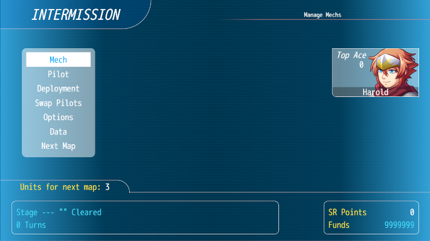
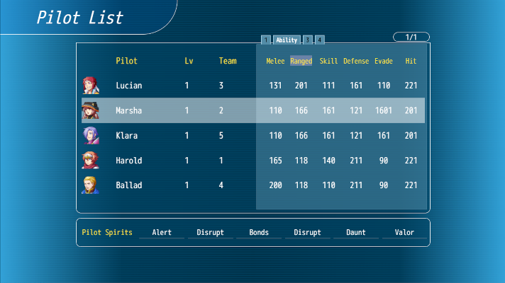
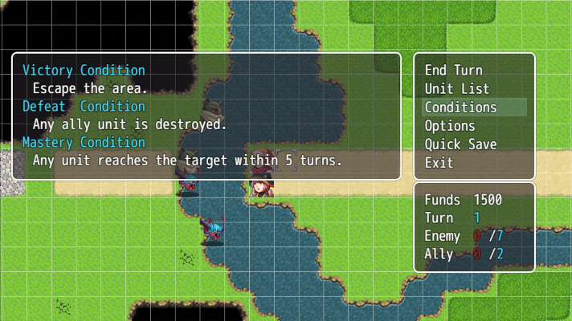
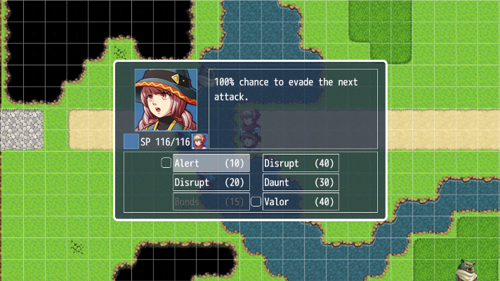
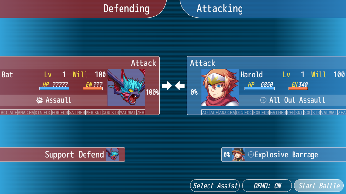

# SRW Engine MV Player Manual V0.1

## Game pad support
* XBOX360 controller 
* DS4 with DS4Windows, 'Hide DS4 Controller' must be enabled! 
* DS5 with DS4Windows, 'Hide DS4 Controller' must be enabled!

# Game play

## Pilots

### Will
Will is a resource that a pilot gains over the course of a stage. It is reset at the start of each stage. Will boosts damage output and defense and some attacks can only be used if the pilot has enough Will. 
Will is gained at a rate of 1 per turn and additional will is rewarded to all members of a faction(ally/enemy) if an opposing unit is shot down. Pilots may also gain will for actions like evading, hitting an enemy, taking a hit, etc. according to their personality.

### Main stats
* Melee: Determines how much damage melee attacks used by the pilot will do
* Ranged: Determines how much damage ranged attacks used by the pilot will do
* Skill: Determines how often the pilot will land a critical and how often a critical will land on them. Also used as a requirement for some abilities.
* Defense: Determines how much damages the pilot's mech will take
* Evade: Determines how well the pilot dodges enemy attacks
* Hit: Determines the hit rate of attacks

### Abilities
A pilot can have up to 6 abilities. These abilities unlock through leveling up or can be purchased and equipped from the pilot upgrade menu in the intermission.

#### Ace Bonus
The Ace Bonus is a special ability a pilot gains once they become an Ace Pilot. A pilot becomes an Ace Pilot by shooting down the required amount of enemies in battle. An Ace Pilot will also deploy with a bit more Will at the start of a stage.

### Spirit Commands
Spirit commands are buffs and debuffs a pilot can use by expending SP. A pilot has up to 6 Spirit Commands. A pilot gains Spirit commands by leveling up and the cost of a command can vary by pilot.

## Mechs

### Main stats
* HP: The health of the mech, a mech will be destroyed if its health reaches 0
* EN: The Energy of the Mech, expended to use attacks
* Armor: Determines how much damage the mech takes
* Mobility: Determines how well the mech dodges enemy attacks
* Accuracy: Determines the hit rate against targets
* Move: How the maximum number of tiles the mech can move per turn
* Size: S(Small), M(Medium), L(Large), LL(Extra large). The size has an effect on the damage taken and accuracy of a mech. In general a larger mech will take less damage but have worse hit and evade rates and a smaller mech will take more damage but have better evade and hit rates.

### Abilities
A mech can have up to 6 abilities. Abilities are built into the mech but additional abilities may be granted by equiping certain Parts.

### Parts
Parts are items a mech can equip, up to a maximum of 4 but some Mechs may have less item slots. Parts can give buffs to stats or grant abilities like barriers. Some Parts are consumable allowing the pilot of the mech to use them during a stage. Consumables can only be used once per stage but are returned after the stage.
Parts are equipped from the intermission menu.

## Attacks
A mech will have one or more attacks, sometimes referred to as weapons.

### Attributes
* Main Type: Melee or Ranged
* Attributes: Additional attributes of the attack represented by a letter or abbreviation
	* Special effects: Indicates if the attack has any special effects. A weapon can have up to two special effect. Ex.: Barrier Piercing, inflict armor down, etc. Indicated by an S
	* Is Post Move: If an attack is Post Move it can be used after moving otherwise it cannot. Indicated by a P
	* Is Counter: If an attack is a Counter attack it will always go first, even on the enemy turn. Indicated by a C
	* Sub Type: A more detailed categorization of the attack, common types are: missile, funnel, beam, gravity, physical. This categorization is used to work with certain abilities. Indicated my as abbreviation, Ex.: Missile = Mi
	* Is ALL: If an attack is an ALL type attack it will hit both targets in a twin. Indicated by ALL
* Power: The base power of the attack
* Range: The maximum and minimum range of the attack
* Hit bonus
* Crit bonus
* Required EN: How much energy is spent to use the attack
* Ammo: If applicable the current and max ammo of the attack. One ammo is used for each usage of the attack.
* Terrain rating: How well the attack works against targets on certain terrain types
* Required Will: How much Will the pilot must have to be able to use the attack

## Spirit Commands
Spirit commands are buffs and debuffs a pilot can use by expending SP.

These are the kinds of buffs and debuffs Spirit commands can apply:

* accel: Grant +3 movement for one move
* alert: Avoid the next attack, overrides Strike
* analyse: Take 10% more damage and deal 10% less damage
* charge: Gain the ability to use weapons after moving that normally cannot. Applies to one move
* disrupt: Accuracy halved
* focus: Final Evasion and Accuracy +30%
* fortune: Next time funds are gained, gain double
* fury: On the next attack ignore defensive abilities(barriers, after image, etc.) of the target
* gain: Next time exp is gained, gain double
* mercy: Next time a target would be shot down, leave them at 10HP instead. Only works if the attacker has higher Skill
* persist: Next time the unit is hit they only take 10 damage from the attack
* snipe: Extend the range of move by 2. Does not apply to moves with 1 range.
* soul: Deal 2.5 times damage on the next attack
* strike: 100% hit rate for one turn
* valor: Deal 2 times damage on the next attack
* wall: Take 1/4 damage for one turn
* zeal: Gain one extra action(cannot be stacked)

Some Spirit commands may apply multiple of these at the same time.

## Terrain
Terrain plays an important role in this SRPG. Each tile on the map has a certain terrain and pilots, mechs and weapons will perform better or worse depending on the terrain.

### Types
* Air
* Land
* Water
* Space

Some mechs may only be placed on certain types of terrain. Ex.: A unit that can't fly can't be placed on a tile that represents an Abyss.

### Ranking
Pilots, mechs and weapons have a ranking for each terrain that ranges from D(worst) to S(best). 

For pilots and mechs the combined terrain ranking is used:

* D + D = D
* D + C = C
* C + C = C
* C + B = B
* B + B = B
* B + A = A
* A + A = A
* A + S = A
* A + S = S

### Bonuses
Some types of terrain may give certain bonuses to units that are on them. These bonus can be to Evasion, Defense, HP Regeneration and EN Regeneration.

# Stages
The main game play happens on grid based stages. There are separate enemy and ally turns, during a turn each unit of a faction can make a move after which the turn is passed to the next faction. 

Each stage has Victory conditions,  Defeat conditions and Mastery conditions. The mastery condition is a bonus condition that awards you with a Mastery Point when completed. The Victory and Defeat conditions may change over the course of a stage.

#### Controls

* Arrows: Select a tile/unit. A summary of a unit and terrain will be shown when the cursor is on a tile.
* Z/Cross: 
	- Empty Tile: Show the Map Menu
	- Ally Unit: Choose an action or show the details if the unit has already finished their turn
	- Enemy Unit: Show the movement range of the unit
* X/Circle: Cancel
* Page up/L1: Previous ally unit
* Page down/R1: 
	* Normal: Next ally unit
	* While a unit is moving: Speed up the movement animation
* Enter/Start:
	- Empty Tile: Toggle the Will indicator for each unit on the map
	- Unit: Show the details of the unit
* Shift/Square: (held)Speed up the cursor
	  
# Menus
## Controls

The controls in menus are generally the following:

* Arrows: Navigate
* Z/Cross: OK
* X/Circle: Cancel
* Page up/L1: Previous item
* Page down/R1: Next item

Some menus may have additional controls, those will be listed below.

## Intermission Menu

The Intermission Menu is where you will be sent between stages. This menu allows you to view and upgrade pilots and mechs, equip parts to mechs, set up the deployment for the next stage, swap pilots around, change game options, save or load the game and proceed to the next stage.

### Pilot and Mech list

These lists displays show information about your pilots and mechs. The lists have multiple views and can be sorted according to each field.

#### Controls

* Arrows: Select a unit, move to a different page
* Z/Cross: View the details of a unit
* X/Circle: Return to the main menu
* Page up/L1: Change the current sorted field
* Page down/R1: Change the current sorted field
* Home/L2: Change the current list view
* End/R2: Change the current list view
* Ins/L3: Change the sort order between ascending and descending

### Upgrade Mech

Upgrade the stats of your mechs. If a mech is upgraded enough you will unlock its Full Upgrade Bonus.

### Equip Parts

Equip parts you have collected to your mechs. These parts will give your mechs certain bonuses or can be consumables that restore HP, EN or SP. Consumables can only be used once per stage but are returned after the end of the stage if used.

### Upgrade Pilot

Upgrade the stats of your pilots and teach them new abilities. PP(Pilot Points) are required. Pilots gain PP by shooting down enemies. PP is not shared between pilots.

### Deployment Window

The deployment window is available from the intermission menu. It can be used to set up which units will be deployed on the next map. The deployment window can also be shown at the start of the stage. The changes made during the intermission will be present in the on-map version so you only need to set up deploys for the next stage once.

In the deployment window certain slots may be locked, indicated by a lock icon. These slots are for units that will take part in events on the next map and can not be changed.

#### Controls

* Arrows: Select a unit
* Z/Cross: Swap units around
* X/Circle: Cancel swapping a unit, return to the main menu
* Shift/Square: Select a whole twin unit to swap around
* Page up/L1: Move the current unit to the front, shifting the other units in the list
* Page down/R1: Move the current unit to the back, shifting the other units in the list

### Swap Pilots

Move pilots between mechs they can pilot. First select a mech then select a pilot to assign. If a mech has multiple seats you select a seat before selecting a pilot.

### Options

Change game options.

### Data

Save and Load save data.

### Next Map

Continue to the next map.

## Stage menus

These are the menus you will use when playing a stage.

### Map Menu
The map menu can be accessed by hitting Z/Cross while on an empty space on the map.

* End Turn: Pass the turn to the enemy. If you have units with remaining actions you will be prompted to confirm. The player turn will not end automatically so you always need to use this option.

* Unit List: Show a list of available units

* Conditions: Toggle the conditions display on or off

* Options: Change the game options

* Quick Save: Create a quick save. Only one quick save can exists at a time. It is possible to instantly reload the last quick save by pressing Z/Cross + X/Circle + Page up/L1 + Page down/R1 at the same time.

* Exit: Return to the main menu or exit the game

### Unit Menu
The unit menu can be accessed by hitting Z/Cross while the cursor is over an allied unit.
Depending on the abilities of the units some or all of the following options may be available:

* Move: Move the unit to a new position. After moving you can attack targets provided the unit has attacks that can be used after moving.

* Attack: Choose an attack and a target to initiate combat.

* Spirit: Choose a spirit from the unit's list of available spirits
	
#### Controls

	* Arrows: Select a spirit
	* Z/Cross: Activate a spirit, or all batched spirits
	* X/Circle: Return to the Unit menu
	* Shift/Square: Add or remove a Spirit from the batch list. Only Spirits with a checkbox can be batched.
	* Page up/L1: Previous (sub-)pilot
	* Page down/R1: Next (sub-)pilot
* Repair: Restore 50% HP to an adjacent ally.

* Resupply: Restore 100EN to an adjacent ally. They will lose 10 Will.

* Fly/Land: Switch the unit between in the air and on the ground. Only available for units that can fly and not available on Space terrain. 

* Transform: Transform the unit.

* Combine: Combine the unit into a new unit if all required units are adjacent.

* Split: Split a combined unit into its parts.

* Join: Twin up with an adjacent unit. Only available if both units have at least 110 Will.

* Separate: Split up a Twin formation.

* Swap: Switch the main and sub positions of a Twin unit.

* Wait: End the unit's turn.

### Before Battle Window
The before battle window gives an overview of which actions each participant in the upcoming battle will take. 

The main participants have their info listed:

* Action: Attack, Defend, Evade or None(-----)
* General info: Name, level will, current HP etc.
* The attack that will be used if applicable
* The chance of hitting the target
* Which Spirit command effects current apply to the participant

When on the defending side you can select which action your unit will take: counter attack, defend or evade. If you have supporters available you can select which one to use with the 'Select Assist' option. You can enable or disable to full battle animations using the DEMO setting. Choosing the 'Start Battle' option will begin the battle

#### Controls

* Page up/L1: Quick swap between counter attack, defend or evade
* Page down/R1: Quick swap between counter attack, defend or evade